# Process log

## 2026-10-03 — Choosing the project: Kessler

Read the final project brief and the week 8 slides, then worked through ideas
with the agent before settling. Rejected along the way: Desire Lines (shallow),
The Commons (liked the regrowth, disliked proposing and voting on rules), Rot
and an A2-linked city displacement game ("Uplift"), then a run of astronomy
ideas building on A1's space theme (Great Silence, Interferometer, Occultation).
Partway through, read the 16 classmates' public final READMEs: mostly utilities and
games, plus co-presence art (Constellation, The Garden, Calligraphy Relay,
Public Canvas), so "people as stars" and "grows while people are together" were
already taken.

Chose **Kessler**: a shared orbit where people launch satellites to be seen,
and collisions cascade into debris. Decisions: beacon incentive (a short line
shown when your satellite passes overhead) with a little coloured light trail;
no reset, the sky slowly heals through orbital decay; 2D chart; owners can
deorbit their own satellite. Written up in `PLAN.md` for detail later.

## 2026-10-03 — Person, persistence, real-time, and the stack ADR

Followed the week 8 lecture's approach: the agent laid out three options for
each question with pros and cons, without recommending, and I picked.

- **Person:** anonymous cookie plus a callsign per launch, one active satellite
  per cookie. Rejected a recovery code and real accounts (friction for a
  stranger's first try). The extra-browsers loophole is accepted for now and
  left for the C10 logs to judge. Not fully decided: ADR 0002 stays
  *proposed* and may change later.
- **Persists:** the sky decays but the catalogue keeps every object's record
  forever, including which collision made each fragment. Rejected deleting
  decayed objects and keeping only counts, since both lose "who caused this".
- **Real-time:** SSE with the server clock as the only clock; clients draw
  positions from stored orbits, so only events cross the network. Rejected
  WebSockets (traffic is one-way) and polling.
- **Stack:** Astro on Node, SQLite via Drizzle on `/data`, SSE, the same as
  crit 7. Rejected SvelteKit and Phoenix LiveView (new to me, three days to C8).

Wrote one decision record each, in `doc/adr/` with an index: 0001 stack,
0002 person, 0003 persistence, 0004 real-time. Writing the consequences
surfaced one hard requirement: Fly stops idle machines, so the server must
replay missed time on boot or collisions silently stop happening while nobody
watches. Added a "Foundations" section to `PLAN.md` and the ADR rule to
CLAUDE.md/AGENTS.md.

## 2026-10-04 — Resolving the open questions for C8

Read the C8 brief first: it only asks for proof of life ("the feature list,
the real-time layer and the polish can all wait"), plus a first README at
`/readme/`. Worked through `PLAN.md`'s open questions one at a time; the agent
gave options with trade-offs and I picked.

- **C8 scope:** proof of life plus SSE (launch, persist, orbits drawn,
  launches live in other sessions). Collisions, debris, decay and deorbit
  move to C9. Kept SSE to get the event plumbing in early, even though the
  brief says it can wait.
- **Overhead:** one shared ground station, so everyone reads the same beacon
  at once. My addition: the landing page is a launchpad; launching shows the
  rocket rising and the camera pans up into the orbit view where the
  satellite appears. A simple pan for C8, the cinematic version in week 12.
- **Beacon:** 60 chars, plain text, no URLs, small blocklist; shown while
  live, kept in the catalogue.
- **Launch limits:** one live satellite each, plus a cooldown (10 min to
  start) after it dies, against relaunch spam.
- **Bands:** low/mid/high with server-side jitter in radius and phase.
- **Deferred:** decay rates, collision radius, fuel and cooldown length to C9
  (tune with the sim running); the name before the final README.

`PLAN.md` now has a "Now and later" section splitting the C8 build from what
comes after.

## 2026-10-04 — Stack restored

`/comp4020:stack` still only targets GitHub Pages and stops on a Fly repo, so
restored the hand-wired stack from `f3e6c27` (reverting its revert `d86a89e`,
which had only been reverted because the stack wasn't decided yet; ADR 0001
now decides it). One change against the ADR: the old setup created a
placeholder `notes` table with raw SQL; replaced that with Drizzle's migrator
running at boot (`drizzle/`, copied into the image) and an empty schema, so
the first migration will be the real satellites table. `pnpm build` and
`pnpm check` green against the local build; Docker build not re-run (daemon
off).

## 2026-10-04 — C8 slice: launch, the sky, live updates

Built test-first. Wrote `spec/launch.test.ts` and `spec/live.test.ts` against
the running app (plus a `spec/session.ts` helper where each Session is one
cookie, i.e. one person), watched all 16 fail, then built:

- **Person:** middleware sets the `kessler_person` cookie (httpOnly, Lax,
  Secure behind Fly's https proxy).
- **Data:** one `objects` table (first migration, `drizzle/0000_objects.sql`)
  carrying ADR 0003's fields minus debris lineage, which comes with
  collisions in C9. Each orbit stores its own period, so retuning the bands
  later doesn't move existing satellites.
- **Orbits:** `src/lib/orbit.ts`, shared by server and browser: three bands
  with jitter, period growing with radius^1.5 within a band, the station at
  the top with a ±12° overhead window.
- **Launch rules:** `src/lib/launch.ts` (callsign ≤16, beacon ≤60, no links,
  small blocklist that also catches "sh1t"-style swaps); one live satellite
  per person and the 10-minute cooldown, checked and inserted in one
  transaction.
- **Launchpad (`/`):** the form posts to itself and works without JS (303
  to the sky, or 422 with reasons and the answers kept). With JS it asks for
  JSON, plays the rocket lifting and the ground falling away, then goes to
  the sky. Reduced motion skips the animation.
- **Sky (`/sky/`):** a polar chart on canvas, drawn from the orbits and the
  server clock; an "Over the station" panel showing beacons as satellites
  pass (and who's next); a server-rendered "In orbit" table so the page
  works without JS. SSE `hello` (server time + snapshot, `mine` flagged per
  viewer, owner ids never sent) then `launch` events.

Visual check at 1920×1080 and iPhone 14 caught two bugs: rows the script
rebuilt lost Astro's scoped styles (no colour swatches, misaligned), fixed by
making the sky page's styles global under `.sky-page`; and on mobile the
rocket overlapped the intro text, fixed with a gutter.

Advay asked to record **Three.js** for the striking visuals: noted in
`PLAN.md` as a later decision (week 12 or sooner), needing its own ADR since
it pulls against the reasons for choosing 2D.

## 2026-10-04 — Adversarial review of the C8 slice, and fixes

A fresh Sonnet reviewer attacked the uncommitted slice against the C8 spec
and the ADRs, using curl against the running build. What it found and what
changed:

- **Every launch would 403 on Fly** (the worst one). Fly terminates TLS, so
  Astro saw `http://` while the browser's Origin said `https://`, and Astro's
  same-origin check refused the form. Local tests couldn't catch it. Fixed
  with `security.allowedDomains` (`*.fly.dev`, localhost) so the forwarded
  protocol is trusted. New tests: a launch through a simulated TLS proxy
  succeeds, and a cross-site post still gets a 403.
- **The blocklist refused "the sky shines tonight"** (and "Sky Station",
  "grape", "therapist"), because it squashed out spaces and matched
  substrings, and "kys" sits inside "sky". Now it matches per word, with
  common endings, plus a few slurs matched anywhere, plus runs of spaced
  letters. The error now says a word was the problem. New tests check that
  ordinary words pass.
- **The link rule was a TLD allowlist** ("evil.ru" got through). Now any
  name.tld, scheme, "www." or "(dot)"/"bit . ly" dodge is refused.
- **Migrations ran on the first request, not at boot** (the db module
  loads lazily). Moved them to `scripts/migrate.mjs`, run before the server
  in `pnpm start`, `pnpm dev` and the Dockerfile `CMD`. Also added a partial
  unique index so the database itself holds the one-live-satellite rule.
- **Error paths:** one broken stream could fail a launch that had already
  saved (each listener is now isolated); an EventSource closed by a 502
  never retried (now reconnects); an unreadable form body caused a 500 (now
  400); a non-JSON refusal showed "couldn't reach the launchpad".
- **UX:** your own satellite's next pass over the station is now shown
  ("next over the station in 2 min 10 s"); the "in orbit" notice sits above
  the chart on mobile; JS-path field errors are tied to their fields for
  screen readers; the form goes inert during the animation; the pulse
  respects reduced motion; personalised pages get `Cache-Control: private,
  no-store`; the chart labels only your own satellite (overhead labels
  collided in a crowded sky; the station panel names them).
- **Tests:** added a returning visitor (still yours, pad closed, no new
  cookie), person ids never in the HTML, beacon markup escaped. Streams now
  close in `finally`. 37 tests, all green.

Left for Advay to decide: whether the catalogue should show every beacon
all the time (the reviewer argued it undercuts "be seen when overhead"), and
whether to add a global cap or rate limit on launches (nothing dies in C8, so
the sky only grows). Deferred: RTT-corrected clock offset, orbit unit tests,
a README layout for `/readme/`.

Decided both open review points:
- **Catalogue shows callsigns only**; beacons are heard only at the station,
  keeping the low-orbit trade-off meaningful. Test changed first (the row must
  name the satellite without its beacon), watched it fail, then dropped the
  column. Without JS you see who's up but hear no beacons, which is accepted.
- **Sky cap of 200 live satellites** (`SKY_CAP`, overridable by env). The
  launchpad says when the sky is full and disables the form. No spec test,
  because filling the shared sky would break the parallel spec files running
  against the same app. Verified by hand instead: with `SKY_CAP=3` on a
  scratch DB, launches 1–3 gave 303, the 4th gave 422 "The sky is full", and
  the pad showed the notice.

## 2026-10-04 — C8 slice committed; README first draft

Committed the slice as `4be85b1`. Then, at my request, the agent drafted the
first `README.md` (about 590 words), even though the brief says to write it
myself, so it's a starting point to rewrite. It argues "good" from the
commons (Kessler and Cour-Palais 1978, Hardin 1968, Ostrom 1990) as four
points, lists which claims `spec/` enforces and which are judged (and how),
and what I chose not to build. `/readme/` now uses the site layout. Still to
do: rewrite it in my own voice, check the sources against what I've actually
read, and add the small-web reading the brief asks for.

## 2026-10-04 — Small-scale reading for the README

The README draft only cited subject sources (Kessler, Hardin, Ostrom); the
brief also wants reading on what good means at small scale. Had the agent
fetch four candidates and summarise them in `notes/reading.md`: Shirky's
"Situated Software" (the best fit: visibility doing the work enforcement
would, like Kessler's lineage), Kazemi's *Run Your Own Social* (limits make
small spaces work), Sloan's home-cooked app and Appleton's barefoot
developers (more for `PROCESS.md`). I'll read them before citing any.

## 2026-10-05 — C9: the sky redrawn as a horizon view (Three.js)

Started branch `C9`. I sketched a new sky view: the planet's limb along the
bottom, a realistic star background, the bands (high, medium, low) stacked over
the horizon, a satellite crossing with a trail and its name, and the "Over the
station" panel floating top-left.

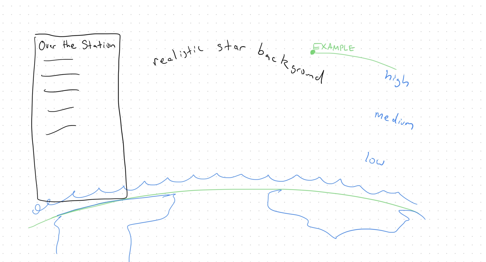

The agent asked four questions first. I
chose the horizon window (only the arc around the station is in view), a
stylised night Earth over a textured one, labels on every satellite but hidden
when they crowd, and the catalogue below the scene.

What was built (`src/scripts/scene.ts`, ADR 0005, proposed):

- Three.js with an **orthographic camera**, so the sim stays the flat 2D chart
  of `orbit.ts`; only the drawing changed. The planet is drawn six chart units
  across while orbits keep their heights, so the bands sit close over a gently
  curved horizon. The view is mirrored so satellites cross left to right.
- A dark sphere with a rim glow, the green **airglow** line seen in photos
  from orbit, and coastlines baked from Natural Earth around the station,
  which now sits on Canberra (`scripts/coastline.mjs`, about 48 kB gzipped).
- About 34,000 seeded stars with spectral colours and a steep brightness
  falloff, plus a faint Milky Way band, thinned on zoomed-out phone views.
- Satellites as glow points with tapering trails, amber while over the
  station; the station's window is an amber wedge. Labels are HTML, placed
  greedily (yours first, then those overhead) so they never overlap.
- Your satellite, when it's out of view, gets a "‹ CALLSIGN rises in 41 s"
  pointer at the left edge.
- Three.js loads as its own chunk after the page works (about 185 kB gzipped).
  Without WebGL, or if the chunk fails to load, the page says so; the panel and
  the catalogue never depend on it.

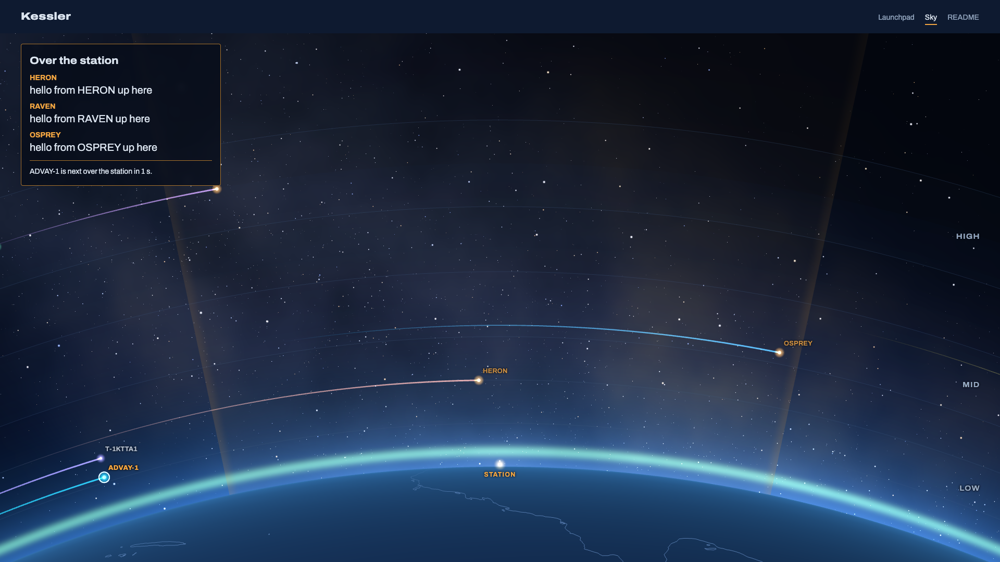

Bugs found while checking it in Chrome: the trails didn't draw (Three.js
culled the dynamic geometry by stale bounds, then back-face culled the
ribbon), the glow sprites had square edges, and on a phone the Earth filled
60% of the scene with stars five times denser than on desktop.

**Adversarial review** (fresh Sonnet agent). Real bugs it found, all fixed:

- an **empty sky threw on every frame** and left the canvas blank (the
  buffers were only made once there was a satellite). Checked on a fresh
  database: now draws.
- your satellite could **vanish with no pointer** while it was behind the
  planet, since the "in view" test checked only x;
- **no fallback if the scene chunk failed to load** (an unhandled rejection
  and a blank canvas);
- the **floating panel hid labels and the pointer** where satellites rise.
  Labels and the pointer now keep clear of it.

Also took its performance points: the loop pauses when the scene is scrolled
away, there are no per-frame allocations in the hot loops, DOM writes happen
only on change, old GPU buffers are freed, the pixel ratio is re-read on
resize, and labels flip left at the right-hand edge and re-measure after the
webfont loads.

Left as judgement calls for me: a **sparse sky can look empty** (only about
7–15% of each orbit is in view, so with a few satellites the scene is often
bare); and the pointer's "rises in" counts to the view's edge while the panel
counts to the station's window, so they differ by a few seconds. Checks green
(typecheck, 37 specs). Committed as `f8f7003` on branch `C9`.

## 2026-10-05 — C9: zooming out to the whole planet

Asked what in the horizon view needed my review, the agent raised that most
collisions in C9 would happen out of view, and that the "Some Light" trails
are mostly off screen too. I chose a zoomed-out view to answer both.

A "See the whole sky" button zooms out; "Back to the station" zooms in. The
planet shrinks from six chart units to the chart's own size while every orbit
keeps its height above the surface, so it's one continuous move rather than a
cut, and the camera's size is scaled geometrically so the zoom feels steady.
The stars moved to their own camera, which at first stayed still while the
planet zoomed; I didn't like the static background during the transition, so
the stars now follow the zoom half as far as the planet does (parallax), like
a far-off sky. Bands, the airglow and the station's
wedge became shaders drawn by height above the planet, so they follow it as it
shrinks. The coastline bake now covers the whole near hemisphere (coarser
outside the station's region; 68 kB gzipped). Reduced motion jumps straight to
the other view.

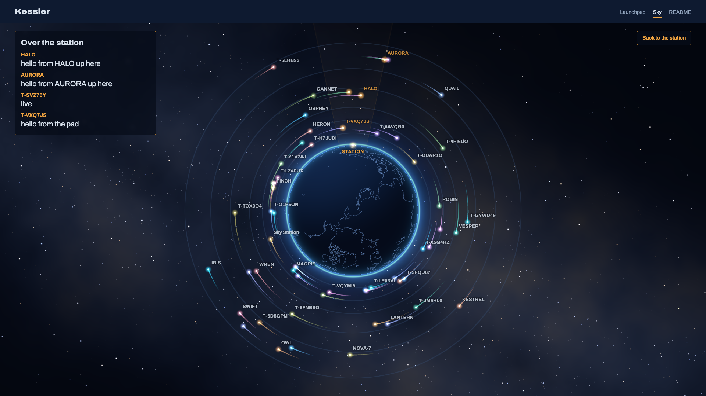

Fixed after checking it in Chrome: zoomed out, the airglow became a thick
halo around the small planet (it now thins with the planet's size), the band
names piled up on top of each other on a phone (they fade out as you zoom
out), and the zoom button hid a label on mobile (labels now keep clear of it).
ADR 0005 (still proposed) now records the zoom.

The zoom-out above was committed as `9cc3927`.

## 2026-10-05 — Soft band edges

Before starting collisions, I asked for randomness in the low/mid/high
boundaries: zoomed out, the satellites sat in three neat rings with clean
gaps. Now a launch's radius comes from a bell curve around the band's middle
(Box–Muller, cut off and redrawn outside the band's reach), so most land
mid-band and about one in eight strays past the band's edges. The reach stops
short of the neighbouring bands, so a launch never lands in the band next door.
That matters for collisions next: in a flat sky of circular orbits, two
objects can only meet if their radii nearly match.

Test first (`spec/orbit.test.ts`, the first pure unit test): with a seeded
random source, 70–97% of launches land inside the band, some on each side of
it, none outside the reach, the bands' reaches don't overlap, and a higher
orbit still has a longer period. It failed (100% inside, no `bandReach`),
then passed. The drawn bands went from a faint fill with hairline edges to a
soft glow following the same curve; my first glow was too faint to see in
Chrome, so it was brightened. Checks green (45 tests).

Soft band edges committed as `baf5342`.

## 2026-10-05 — The table leaves the sky page

I didn't like the big table under the sky: too much scrolling, and debris in
C9 would make it far longer. The agent offered three layouts (a summary on
the sky page with the full catalogue on its own page, a drawer over the
scene, or tabs in the station panel); I chose the first.

- **`/sky/`** now ends with a "Sky now" card under "Over the station":
  the total, counts per band, the six latest launches (newest first, kept live
  over the stream) and links to the catalogue and the launchpad. On desktop
  the page is exactly one screen; a crowded pass scrolls inside the station
  panel instead of pushing the card down.
- **`/catalogue/`** is the full record: callsign, band, launched and status,
  in orbit or everything ever launched, picked by a plain link so it works
  without JavaScript. It's in the site nav, and ready for debris rows.

Tests first: new `spec/sky.test.ts` (counts per band match the page's own
sky data, the latest launches are newest first and carry no beacons, the
sky page has no table and links to the catalogue; the catalogue lists and
marks yours, and has the "everything" view). The C8 specs that read the
sky page's table rows now read the catalogue's; the person-id check covers
both pages. Seven failed for the expected reasons, then all 50 passed. Fixed
after checking in Chrome: the counts line ran together ("orbit:Low 51 ·Mid"),
now three small tiles, and the desktop page scrolled 4px past the screen.

## 2026-10-05 — A station panel that holds still

Reviewing that in the browser, I found two things jarring: "Over the station"
grew and shrank every time a satellite rose or set (it scrolled inside up to
16rem, and the card below jumped with it), and after a launch the "in orbit"
notice pushed the Sky now card off the bottom of the screen.

- The station panel is now a **fixed height**: three beacon slots (callsign
  plus at most two lines of beacon), a small "N overhead" line, and a
  reserved line for yours. With more than three overhead it **pages** through
  them every 4s ("4–6 of 9 overhead"), sorted by id so pages don't reshuffle,
  and each new page fades in. Measured in Chrome over twelve seconds of
  paging: the panel stayed at exactly 304px (366px with yours).
- The launched notice is a **toast** over the top of the scene, so it never
  moves the panels; it fades after 6s. On a phone it stays in the page flow.
- On shorter desktop screens the Sky now card gives things up rather than
  overflow: latest launches cut to three below 56rem tall, gone below 46rem,
  band tiles gone below 40rem. No page scroll at 1920×1080, 1440×800 (with
  the toast) or 1280×680; on an iPhone 14 the panels stack under the scene as
  before.

No new spec: this is layout, which the HTTP suite can't see. Checks green
(50 tests).

Catalogue page, Sky now card and the steady station panel committed as
`455789e`.

## 2026-10-05 — The launchpad fits a laptop screen

On my laptop the launchpad scrolled: the Launch button sat below the fold.
Measured in Chrome, the page was 919px tall at every laptop size, because the
form ran 727px plus a 5rem bottom margin.

- Each altitude is now two lines: the name with how often it passes ("over
  the station every 3 minutes") on the right, then its note. This was 292px of
  bands, now 235px.
- Tighter spacing in the form, a 1.5rem bottom margin, and top padding that
  scales with the screen's height, not its width.
- Below 46rem tall, each band drops its note and keeps the pass time, so it
  still fits at 1280×680.
- The rocket is capped to the room between the intro and the ground. Once the
  page was exactly one screen, it ran into the "Nobody owns the sky" line.

No scroll at 1920×1080, 1512×860, 1536×770, 1440×800, 1280×720 or 1280×680,
and the rocket's top stays below the text at each. The phone layout is
unchanged and scrolls as before. Layout only, so no new spec; checks green
(50 tests).

## 2026-10-06 — Future work: collisions between messages

Advay wants colliding messages to mean something: right now two beacons
collide by orbit alone and share nothing. Added "Collisions that mean
something" to `PLAN.md` as open future work, with four directions (the wreck
keeps words from both beacons, the collision shown as a couplet, seeing your
band's beacons before you write, and aiming a "reply" launch, probably
rejected as it makes debris intentional), plus the questions to settle first.
It touches the debris data model, so it's flagged to decide before C9's debris
table.

## 2026-10-06 — Future work: a purpose

The app had an incentive (be seen) but no goal and nothing shared to lose.
Brainstormed four ideas with Advay; three went into `PLAN.md` under "A
purpose" as future work he wants to think over: a "heard by" count as each
satellite's score, debris taking the station's airtime as static, and a
question from the station that beacons answer (which also gives colliding
messages a connection). The fourth, a shared sky-health number on every
screen, was left out for now.

## 2026-10-06 — Future work: explain Kessler syndrome

Advay found that people don't know what Kessler syndrome means, so the name
and the argument don't land. Added a plain-language explainer page (e.g.
`/kessler/`) to "Later" in `PLAN.md`: what it is, the real cases, the
commons angle and how the app's mechanics map onto it, linked from the
launchpad and the sky. Not scheduled yet.

## 2026-10-06 — The launchpad in Three.js, and a launch that becomes the sky

I liked the launchpad's layout but wanted it more striking, and the launch
more realistic. The SVG rocket is now a Three.js scene behind the unchanged
form (ADR 0006, proposed).

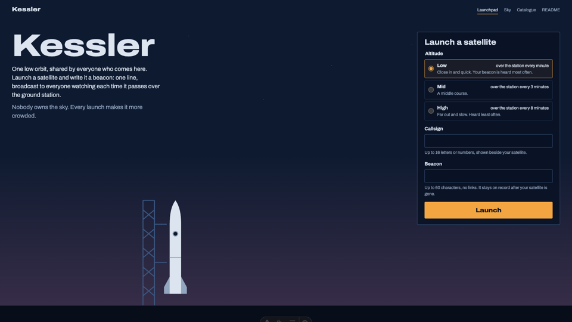

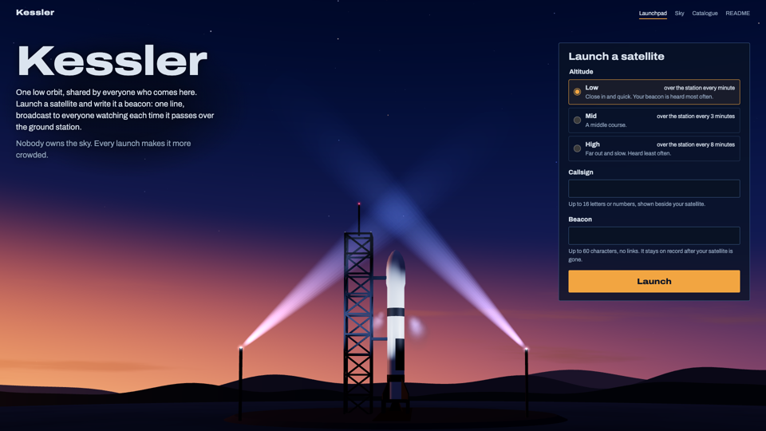

- **The scene** (`src/scripts/launchpad.ts`): dusk at the pad, with a lit
  rocket, a lattice tower with umbilical arms and red warning lights, two
  searchlights, ridges of hills fading into the haze, thin cloud and the same
  stars as the sky page (now shared through `src/scripts/starfield.ts`). It's
  framed from the page's own layout: between the intro and the form on a
  desktop, in the gutter beside the intro on a phone, standing on a horizon
  just above the form.
- **The launch**, about seven seconds: ignition and a ground cloud thrown out
  sideways by the flame trench, the arms swinging back, liftoff with camera
  shake, a gravity turn eastward (left to right, the way satellites cross the
  sky page), and a plume that lights up blue-white once it climbs into
  sunlight the ground can't see. The pad sits on top of a planet, so the
  camera pulls back until the ground is the planet's limb, like the sky
  page's view, then fades to the sky page's dark, and the sky page's canvas
  fades in from it. A readout shows the callsign, the band, T+, altitude and
  speed. Skip button and Escape.
- No JavaScript: the form posts as before. No WebGL, or the scene stops: the
  SVG rocket and its CSS launch come back. Reduced motion: a still scene, and
  a launch goes straight to the sky.
- Three.js is its own chunk, shared with the sky page, so it's cached by the
  time the launch arrives there.

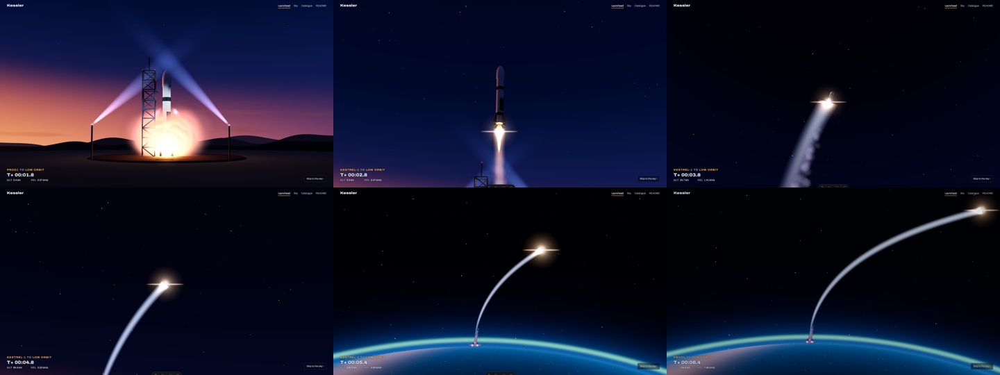

Fixed while checking it in Chrome: the rocket drew at its minimum size (I
measured the intro's grid cell, which stretches to the form's height, not its
text); puffs of smoke thrown at the camera filled the screen as overexposed
squares (now thrown sideways, faded near the camera, and round to the
sprite's edge); a teal flood across the sky as the camera rose through the
atmosphere's shell (the limb glow now only counts lines of sight that dip
below the horizontal); and on a phone the rocket left the frame during the
pull-back (the camera follows it longer, and the end shot turns towards its
arc). The dev server also served a stale page script until the file was
touched.

**Adversarial review** (a fresh Sonnet agent, on the diff). Acted on:
- A shader failure or a lost WebGL context mid-launch could leave a blank,
  inert page. The scene now stops, hands back to the SVG rocket, and the
  launch still ends; the page goes to the sky after ten seconds whatever
  happens.
- The launch clock ran on wall time, so a background tab skipped to the end;
  it now advances with the frames drawn.
- Escape and Skip could navigate twice; focus is moved to Skip when the
  launch starts; the screen-reader status is set after the form goes inert.
- Phone cost: the two spheres drop from 384×192 to 192×96 segments, the
  ground's noise is skipped once the camera is in orbit, the idle scene
  draws at 30 fps, the layout is measured on scroll and resize instead of
  every frame, and point sizes respect the GPU's limit.
- The SVG rocket now fades out as the canvas fades in, not before.
- Contrast: the intro text sits over the bright afterglow on a phone, so it
  has a soft dark haze behind it as well as a text shadow; the dim paragraph
  measures about 5:1 against what's behind it.

Visuals only, so no new spec. Checks green against a fresh production build
(50 tests), checked at 1920×1080, 1440×800, 1536×770, 1280×680 and iPhone 14.

## 2026-10-06 — Assignment 1's performance harness, carried over

Commit `d06ee96`.

Worried that two Three.js scenes (the launchpad and the sky) would perform
badly, especially on a phone, I asked for assignment 1's performance harness
to be carried over and made to work here, without running the full suite
yet. The harness was the part of assignment 1 that taught me to distrust a
smooth frame rate: a vsync-clamped 60 or 120 fps hides whether a frame used
a tenth of the GPU or all of it, and assignment 1's PR #20 drew a false
conclusion from exactly that.

What carried over unchanged: the report maths (`scripts/performance/report.ts`,
with its tests), Chrome driven through `playwright-core`, the three named
profiles (marking desktop, a throttled phone, a throttled laptop), the
long-task, layout-shift and frame-miss sampling, the blank-page refresh
calibration, and the GPU saturation probe that raises the drawing buffer until
frames miss vsync and fits cost from those points only.

What had to change, because this is a different kind of app:
- **A server, not a folder.** Assignment 1 served `dist/` statically. Kessler
  is server-rendered with a database, so the runner starts the built server
  itself on a free port and a throwaway SQLite file, as the Dockerfile runs it
  (production bundles, not the dev server). It never touches `data/app.db` or
  the running app. Pointed at a deployed sky (`PERF_URL`), it launches nothing.
- **A crowded sky.** The sky's per-frame cost (points, trails, label
  placement) grows with what's in orbit, so the runner seeds 150 satellites,
  one cookieless visitor each, since the server allows one live satellite per
  person.
- **Two scenes, and a real launch.** The in-page probe now names which scene
  it is attached to, and hooks into both `launchpad.ts` and `scene.ts`. The
  phases are the app's own: the launchpad idling behind the form, the launch
  sampled frame by frame from ignition until the page fades to the sky, then
  the sky's station view, zoom out, whole sky, and scrolled away.
- **No fixed pixel cap.** Assignment 1 capped its globe at 1.25 Mpx and
  predicted GPU cost there; neither scene here caps beyond a device pixel ratio
  of 2, so cost is predicted at the buffer each profile actually allocated.
- **The launchpad's 30 fps idle throttle** would read as a saturated GPU
  (a steady 33 ms frame), so the GPU probe lifts it while measuring.
- **Budgets for a lazy scene.** The fast layer now checks `dist/client` byte
  budgets per chunk, and that three.js is never in a page script's static
  import graph: both pages are meant to work before the scene arrives.

First smoke run (desktop profile only, headless, M4): no frame misses or long
tasks in any phase with 150 satellites; the launchpad idles at 30 renders/s
as designed. The first GPU ladder (to 20 Mpx, assignment 1's) never saturated
either scene, so there was no slope at all: these scenes are much cheaper than
assignment 1's procedural planet. Extending it to 36 Mpx gave the sky a fit
(0.85 ms/Mpx) but only from two points, which always shows R² 1.000, so the
suite now flags a fit that thin rather than letting it look authoritative. The
launchpad still didn't saturate twice. One run also flagged 432 ms of blocking
time loading the sky on desktop, which didn't recur on the second run; a
lead for when the full suite is run, not a conclusion. Chrome 154 headless
also calibrated at 60 Hz where assignment 1's runs saw 120 Hz, which matters
when comparing reports across the two projects.

## 2026-10-06 — A page explaining Kessler syndrome

Built the explainer from `PLAN.md` at `/kessler/` (`src/pages/kessler/`),
server-rendered so it reads the same without JavaScript:

- **What it is** in plain words, with a three-step diagram (two satellites on
  crossing orbits around a small Earth, the burst where they meet, then the
  fragments on orbits of their own hitting a third). The diagram is SVG worked
  out at build time, so the collisions sit exactly where the orbits cross.
- **Why it doesn't clear:** drag times by altitude (NASA's debris FAQ), and
  Kessler and Cour-Palais (1978).
- **The real cases:** Fengyun-1C (2007) and Iridium 33 / Kosmos-2251 (2009),
  from NASA's *Orbital Debris Quarterly News* for each, plus ESA's 2025
  figures (about 40,000 tracked, more than 1.2 million over a centimetre, and
  debris growing even with no more launches).
- **The commons:** Hardin, the FCC's 2022 five-year rule and how little of
  the sky it reaches, and Ostrom.
- **How this sky plays it:** a table mapping real orbit onto the app, with
  collisions, decay, deorbiting and debris lineage tagged "not built yet",
  since none of them exist yet. The band times come from `BANDS`, so they
  can't drift from the launchpad's.
- **Linked** from a new "Kessler syndrome" nav item (the nav now wraps on a
  phone), the launchpad's intro and the sky's "Sky now" card.

Every figure was checked against its source before it went on the page.
Test first: `spec/kessler.test.ts` (the page answers, names the two cases and
the 1978 paper, links back to the sky and the launchpad, and both of those
link to it in their content). All five failed (a 404 and no links), then
passed.

**Adversarial review** (a fresh Sonnet agent, against the plan, the sources
and the running build). Acted on:
- **The diagram's "crossing" orbits only touched.** The first draft had two
  arcs meeting tangentially, with no planet and no direction of travel. Redrawn as
  tilted ellipses around an Earth, with trails on the satellites.
- **Overclaims.** "It has already started" (neither case set off a runaway)
  became "The debris is already up there", with a line saying so. "Run on the
  same logic" became an honest account: the app has the incentive half of the
  dilemma (crowding low gets you heard) and none of the cost yet.
- **Sources stretched.** Kessler 1978 said a belt "could begin to form within
  this century" and that launch limits could delay it, not "within decades".
  The FCC rule covers only satellites launched after 29 September 2024, and
  25 years was a guideline, not an FCC rule. "Switched off since 1995" and
  "nobody aimed either" weren't in the cited source, so they're gone. The
  drag times were unsourced (now NASA's FAQ). Ostrom was reduced to
  monitoring (now also own limits and answering to each other).
- **Plain language and accessibility:** the page now says why the app is
  called Kessler; "In Kessler" became "In this sky", so it can't be read as
  the syndrome; the diagrams are hidden from screen readers (their numbered
  captions carry the meaning); the phone table labels both halves of each
  pair; the catalogue row was split so built and unbuilt aren't in one cell.
- **The launchpad link explained nothing**, so its line now says what the
  term means: "in a crowded orbit one collision can set off the next: Kessler
  syndrome". That was an open question in the plan; it's there for me to
  keep or cut.

Left: the nav label stays "Kessler syndrome" (the reviewer suggested "What is
Kessler?"), and the mobile table loses table semantics in Safari once it's
display:block, accepted for now.

Checked in Chrome at 1920×1080 and iPhone 14. The launchpad still doesn't
scroll at 1920×1080, 1536×770, 1440×800, 1280×720 or 1280×680 with its
longer line, and the sky page is still one screen at 1920×1080. Checks green
(55 tests).

Then I found the launchpad's in-sentence link too easy to miss, twice over. It
is now a card of its own under the intro: "New here?" above a large amber
"What is Kessler syndrome? →", with a dark backing and a soft glow so it
reads over the afterglow on a phone. The intro's line keeps the one-line
explanation ("in a crowded orbit one collision can set off the next"). Still
no scroll at any of the laptop sizes above.

## 2026-10-06 — Orbital decay, and burning up on re-entry

Committed as `fb51cae` (everything below, including the review's fixes, the
catalogue heights and the shorter decay), pushed to `C9`.

Worked on branch `C9` (fast-forwarded to `main` first). Advay asked for
orbital decay: everything slowly loses height and burns up, with bands as
ranges rather than fixed shelves, and a re-entry that looks real.

**The model (ADR 0007, proposed).** Positions had to stay a pure function of
the stored orbit and the server's clock (ADR 0004), so decay is a law with a
closed-form answer rather than stepped drag or periodic re-saves:
- One period for every height (`periodAt`), fitted so the low band's middle
  still comes round once a minute and the high's every eight. Before, each
  band had its own law, so a high satellite that fell into the low band
  would have crawled past the low ones. Mid moves from 3 to 2.7 minutes.
- radius^6 falls at one steady rate, so orbits fall slowly, then faster.
  From the low band's middle an orbit lasts a day, the mid's about 8 days,
  the high's about two months. The angle integrates in closed form.
- At 1.06 planet radii a scripted 30-second plunge: it dives, slows hard
  (angular speed ∝ (1 − 0.85s)³) and has burned away at 1.005.
- Bands are ranges meeting at 1.5 and 2.05 (`bandAt`); the sky page counts
  objects by where they are now.

Test first: `spec/decay.test.ts` (13 tests: continuity at the epoch and into
the plunge, monotone fall, lifetimes per band, speeding up as it falls, the
plunge's length, contiguous band ranges, a high orbit drifting through mid
and low). All failed on missing functions, then passed. HTTP tests added:
the launchpad shows each band's lifetime, the sky's band counts follow
current height, `/kessler/` no longer marks decay "not built yet".

**Server.** `settleDecay()` in `src/lib/sky.ts` runs before every read of the
sky and on a timer set for the next burn-up: live rows past their burn-up
become `decayed`, dated to the burn-up itself, and a `decay` event goes out.
A stopped server catches up on its first request. Checked by hand: demo
satellites inserted to burn within seconds were marked with the right
`fate_at`, and the `decay` event arrived on `/api/events`.

**Client.** Every page works out burn-ups itself, so all screens see the same
moment; the event only confirms. A burned object stays 8 s while its wake
fades. "Sky now" says what's burning or burned up last (most happen out of
the station's view); your own satellite's line says when it burns up. The
launchpad's band choices say how long each lasts. Catalogue fate reads
"Burned up".

**The re-entry** (`src/scripts/reentry.ts`), modelled on photos of real
re-entries (ATV-1, Starlink and rocket stages over the Americas, Soyuz from
the ISS): a hot head with a bow-shock glow and a white point, a wake cooling
white → orange → red that billows as it ages, a faint green train, a breakup
into a string of fragments that fall behind (seeded by the object's id, so
every screen sees the same one), sparks shed behind, and flares as pieces
burn out. A satellite glows red in the last few minutes before its plunge.
The bands were redrawn as contiguous washes with soft lines where they meet.

How it got there, checked with frozen-clock screenshots (overriding the
page's clock to exact moments of the plunge) and recordings:
- First pass blew out to a white blob with a lavender halo. Two causes: the
  colours were sRGB-ish values going through three.js's linear→sRGB
  conversion, and pure additive blending over the bright blue haze. Fixed
  with a linear-light blackbody ramp and premultiplied blending, so the fire
  partly hides the haze behind it and stays orange.
- The burn sat inside the bright green airglow line and got lost; the plunge
  was lowered (1.06 → 1.005) to burn in the haze just above the limb.
- At first the plunge swept 120° in 30 s, crossing the view in a few
  seconds; the angular speed now falls as a cube, so it streaks in fast and
  lingers while brightest.
- Fragments bunched at the head; their lag was raised so they string out
  behind. Late in the plunge their ribbons drew vertical smears (their
  heading came from their own slow sinking); headings now follow the orbit.

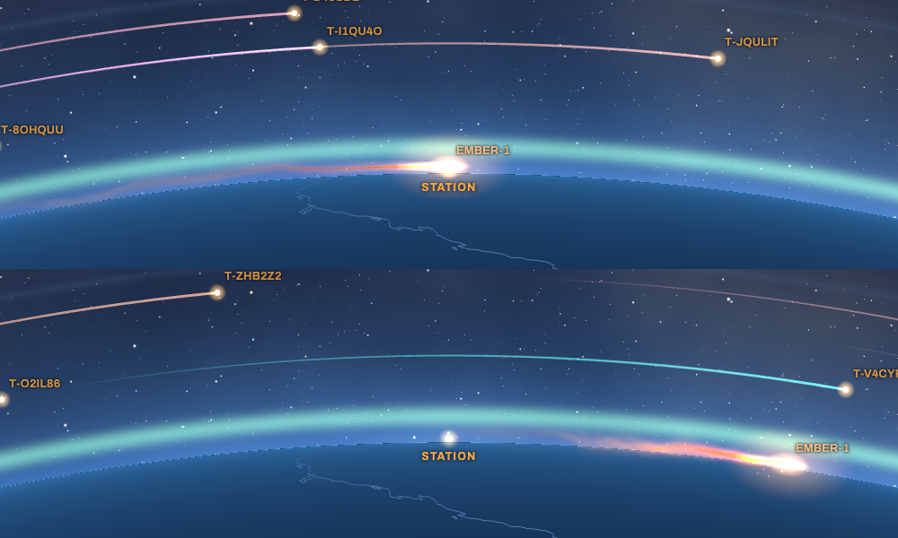

Checked at 1920×1080 (horizon and whole-sky views) and iPhone 14; the
launchpad still doesn't scroll at 1920×1080, 1280×720 or 1440×800. Checks
green against a fresh production build (70 tests).

**Adversarial review** (a fresh Sonnet agent, code read and numeric checks
of the maths). No bug in the core maths: radius and angle are continuous
through the burn. Acted on:
- **The lifetimes were only true at a band's middle.** A launch lands
  anywhere in its band's reach, so a low launch can burn up in 5 hours under
  a page that said "about a day". The launchpad now shows each band's spread
  (`lifetimeRange`: 5 hours to 2 days, 3 to 18 days, 3 weeks to 4 months),
  as do `/kessler/`, the ADR and the plan. Test first: the launchpad test
  asked for the spreads and failed on "about a day".
- **Pass countdowns ignored the burn-up.** "Next over the station in 3 min.
  It burns up in 1 min" for a satellite that never gets there. Countdowns
  now return nothing when the burn-up comes first, and say so ("burns up
  before it next reaches the station", "burns up before it rises").
- **One remembered burn-up.** Two burn-ups close together could leave your
  satellite's line stale. Burn-ups are now kept by id; the latest and your
  own are looked up from them.
- **The server's marking was untested.** `spec/decay-server.test.ts` drives
  `settleDecay` against a throwaway database with the clock passed in:
  marked `decayed` at the burn-up's time with a `decay` event, once only,
  caught up on the next read after a quiet spell, and the cooldown counted
  from the burn-up (passed first time: regression cover).
- **Reconnecting cut a burn-up short**: the snapshot replaced the whole sky.
  It now keeps what's burned up but still fading.
- **"Sky now" was usually empty** between burn-ups; it now says what burns
  up next ("Next to burn up: X, in 5 h"). Your satellite's line links back to
  the pad once it's gone; the catalogue says what "Burned up" means.
- `periodNow` grew for an orbit starting below the burn radius (unreachable
  by launch, fixed anyway, with a test); each settle reads the sky once, not
  twice.

Left, and written into ADR 0007: nobody can see a burn-up on demand (the
shortest lifetime is hours, one satellite each), so "something happens
within ten minutes" falls to collisions; catch-up runs on the first request
after a restart rather than at boot; and the dive's radial speed jumps at the
plunge's start (position is continuous; no kink was visible in recordings).

**Heights in the catalogue** (Advay's ask: "so we can see them slowly go
down"). A Height column with each live object's height in km and how fast
it's falling ("590.22 km ↓ 13 km/h"), ticking once a second from the orbit
and the server's clock; "—" once burned up. The km scale (2,000 km per
planet radius, ADR 0007) puts the burn-up at 120 km, where real re-entries
begin, and the low band at 400–800 km. Test first: the catalogue test asked
for the column and a height inside the low band's reach, and `heightKm` /
`fallRate` got unit tests; all failed, then passed. Two decimals so a low
orbit visibly drops every few seconds. On a phone the table overflowed:
the Band column now drops (the height says where it is), the rate sits
under the height, and the status time is hidden. That last rule never
worked (`td time:not(:first-child)` matched nothing in the Status cell) and
only showed once something had burned up; it's a class now. Checked at
1920×1080 and iPhone 14 (no horizontal scroll).

Advay asked to note "seeing a burn-up on demand" for later: in `PLAN.md`.

**Decay shortened** (Advay: "high should get only a few days max"). The first
rates (radius^6, a day from the low band's middle) let a high launch last up
to four months. Now radius³ falls at a steady rate and the low band's middle
lasts 4 hours: low 1 to 8 hours, mid 9 to 27 hours, high 31 hours to 3 days.
radius³ was picked over radius² because it keeps three distinct tiers and
still speeds up as it falls (about 1.5× faster near the air than at the low
band). Tests first: the lifetime test now asks for hours / about a day / a
few days at most, and that no launch lasts past 3.5 days; it failed, then
passed. The fall-rate test's "10× faster low than high" pinned the old law;
the contract is only "faster the lower it is". The launchpad and
`/kessler/` read the spreads from the code, so only their tests changed.
A side effect: a low satellite now drops about 100 km an hour, so the
catalogue's heights visibly fall within seconds.

Advay also asked to shelve **boosting a satellite** (raising your own orbit
to stay up longer) for later: in `PLAN.md`.

## 2026-10-06 — C9: planning collisions and login

Advay wanted to start collisions for C9 and add a login, to track who
launched what and who to blame, but wasn't sure how collisions could work.
The agent read the orbit maths and found the snag: the chart's orbits are
flat circles whose period depends only on height, so two objects going the
same way at the same height never close in, and decay (radius³ falling at
one rate for all) keeps the gap between any two objects fixed. As built,
almost nothing would ever collide. Options it gave: a bigger hit distance on
the current model (rare, slow overtakes), mixed directions (head-on crossings
twice a lap), or hidden 3D inclinations (rendering rewrite).

Decided with Advay (now in `PLAN.md`): **mixed directions plus a little
same-direction near-miss**; the server predicts hits ahead and broadcasts the
impact time so every screen draws it at once; restart catch-up runs the hit
queue forward; **seed derelicts** so a quiet sky still collides; **optional
login** (claim a unique operator handle with a passphrase on top of the
anonymous cookie, superseding ADR 0002); blame worked out from lineage;
**C9 scope is collisions + login**, with dodging moved to C10. Details still
open are listed under "Open questions"; decision records come once they're
settled. Checked the C9 spec first: it asks for one written decision about
several people acting at once, which still has to be picked now that dodging
(the obvious candidate) moved out.

Second round, same day: the C9 written decision is **who sees the blame**
(dodging, the first candidate, moved to C10); the server picks each orbit's
direction at random (retrograde gives no airtime, so a free choice would be
a trap); signing in on a device with its own live satellite merges it into
the operator's record; a collision shows both beacons as a couplet, with
fragments carrying words left for later (a nullable column, so deferring is
cheap). Derelict count, fragments per hit, the live cap and debris decay are
to be tuned with the sim running.

## 2026-10-06 — C9: collisions on the server (branch `C9`)

Advay asked to keep the C9 work on the `C9` branch, so it moved into the
existing `.claude/worktrees/C9` worktree (CLAUDE.md says `main`; his
instruction wins). Wrote ADRs 0008 (collisions predicted in closed form),
0009 (an operator you can claim; supersedes 0002) and 0010 (every screen
names who caused a collision: the C9 "several people at once" decision), all
proposed.

Built test-first: `spec/collision.test.ts` (the maths: direction, when two
orbits meet, fragments from a seed) and `spec/collision-server.test.ts`
(announced ahead, applied at its time, fragments tracing back, and a
stopped server ending with the same sky as one that ran through a cascade).
Orbits gained a direction (`turnedAt`, the unwrapped angle); the server
predicts each pair's meeting once, keeps a schedule, announces
`conjunction` events and applies `collision` events. Migration
`0001_collisions` adds the `collisions` table, `direction` and
`source_collision`.

The interesting part was tuning, with a throwaway harness simulating a day:

- First version: any two objects inside the hit distance were certain to
  meet within half a lap. One collision's six fragments in a thin shell set
  off the next, and a 40-object test shell ran away to the 600-object cap
  within a minute, with thousands of collisions an hour that never stopped.
  The catch-up loop also re-sorted every pair per collision, so the test hung.
- Fixes, each found by the harness: debris is small (a fifth of a
  satellite's hit distance); each meeting is a chance (5% head-on), drawn
  once per pair so replays agree; fragments scatter widely in height; a
  fragment that hits something is pulverised (debris can't multiply on its
  own, so a cascade feeds on satellites and dies out when launches stop);
  the derelict baseline counts satellites and derelicts only and adds at
  most one every 10 minutes (the first version kept refilling derelicts into
  its own debris field and fed a permanent cascade).
- Result: a quiet sky holds a steady 5 to 15 collisions an hour with about
  a hundred objects up, no runaway, settling in milliseconds. Open trade-off
  for Advay: at that rate most satellites end in a collision within an hour
  or two rather than burning up.

`decay-server.test.ts` now turns derelicts off and seeds its launches, since
random satellites can now collide. The sky page's "latest launches" lists
people's satellites only. `pnpm check` green (101 tests). Committed as `41f32ef` on branch `C9`.

Advay chose **gentler** over deadly (asked with the simulated numbers): head-on
hit distance 0.012, 2% a meeting, lapping 0.015. A quiet sky now has 1 to 5
collisions an hour, satellites typically last 2 to 4 hours before a hit, and
about half burn up first; a visitor may wait 15 to 30 minutes for a
collision, which the conjunction warnings will have to carry.

## 2026-10-06 — C9: launch as often as once a minute; collisions scale with satellites

Two notes from Advay while the collision slice was going in: collisions
should scale up with the number of satellites, and the wait to launch
should be much shorter, because "the whole point is someone can send more
satellites to send more messages but increase the risk of ruining it for
all".

Scaling, measured with a harness holding K people's satellites up (each
relaunching as soon as allowed, under the old one-each rule): 0 or 5 people
give 1 to 4 collisions an hour, 20 give about 20, 50 about 130. So it scales
more than linearly, but only once people outnumber the derelict floor of 20,
which keeps a quiet sky's rate flat. The agent offered to lower the floor to
about 8; Advay kept 20.

The launch rule: the agent read "send more satellites" as several up at
once, which reverses "one live satellite each" (ADR 0002, 0009), and asked.
Advay chose **any number up, a minute apart** (over a per-person cap, or one
each with a shorter wait). Tests first: `spec/launch.test.ts` (a second
launch inside the gap is refused with "You can launch again in N s"; the pad
stays open, listing yours) and `spec/decay-server.test.ts` (two up at once
a gap apart; someone else isn't held up). Migration `0002_launch_gap` drops
the one-live unique index. The launchpad lists your satellites and counts
the gap down; the sky page's line follows whichever of yours reaches the
station next. ADR 0009 (still proposed) and the plan updated; the
`/kessler/` page's "one satellite each" line changed.

Measured with the new rule, people launching every two minutes: one person
alone takes the sky from about 2 collisions an hour to about 60, and three
take it to 160 with the sky at its 600-object cap. That's the argument made
literal, and also what three people can do to everyone else's evening (and
to a phone drawing 600 objects). Flagged for Advay: the gap may want to be
longer than a minute.

`README.md` still says "one live satellite each" in two places; left for
Advay, who is rewriting it in his own words. `pnpm check` green (102 tests).

Advay set the gap to **five minutes** after seeing those numbers. The wait
now reads "You can launch again in 4 min 05 s." Committed as `5cf1247`.

## 2026-10-06 — C9: collisions on the sky page and in the catalogue

The sky page now shows collisions as they happen, on every screen at the
same moment, since each one is predicted (ADR 0008): a pulsing amber ring
where two objects will meet over the last 30 seconds, then a flash and a
ring spreading out at the moment of impact. Both objects leave the scene at
once (the flash covers it); the server's `collision` event brings the
fragments. Debris draws as small grey points with faint trails, derelicts
dim, and only people's satellites are named. A card over the scene (under
it on a phone) tells the collision: what met, the two beacons side by side,
and who launched what (ADR 0010). "Sky now" counts satellites, derelicts
and fragments apart, and says what's coming ("Collision coming: SAT-12 and
debris, in 0:40") or what just happened.

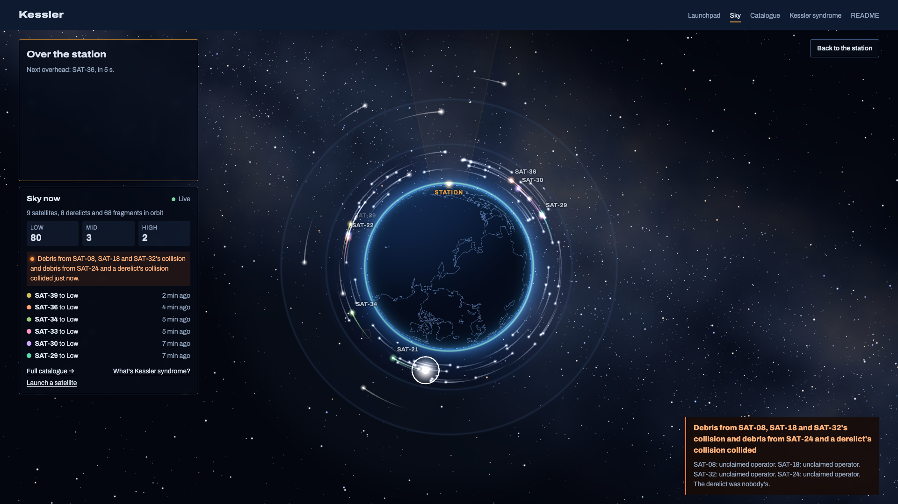

The wording is its own module (`src/lib/story.ts`), tested in
`spec/story.test.ts`: "A and B collided" (never "A hit B"), "Debris from A
and B's collision destroyed C", and the blame line naming every operator at
the root ("unclaimed operator" until login exists). The server's collision
event now carries these parties, with debris traced back to its roots
(`spec/collision-server.test.ts`). The catalogue shows each fragment's
lineage and what each destroyed object met, and a new Collisions section
keeps the latest 50, told the same way.

Fixed on the way: several places assumed every orbit runs anticlockwise
(trails, the "rises in" pointer, the next-overhead countdown, the re-entry
breakup); a retrograde satellite now trails behind itself, rises on the
right, and its pointer sits at the right edge.

Checked in Chrome against a seeded sky (40 satellites crowded into one
shell, so collisions came every minute or two) at 1920x1080 and iPhone 14.
On the phone the card first covered half the scene, station included, so
it moved under the scene there; the catalogue's lineage broke callsigns at
their hyphens in the narrow column, so those hyphens are now non-breaking.
`pnpm check` green (110 tests).

## 2026-10-06 — C9: operators you can claim (login)

Built ADR 0009 test-first (`spec/operator.test.ts`, 11 tests over HTTP): no
sign-up to launch; claiming a handle keeps what you launched before; a
handle is taken whatever its case; bad handles and short passphrases are
refused with reasons; signing in on another device makes your satellites
yours there; a wrong passphrase and an unknown handle get the same answer;
the five-minute gap is per operator, not per device; signing out gives the
device a fresh anonymous cookie; no page shows a passphrase or a person id.

`src/lib/operators.ts` keeps operators (handle, scrypt hash and salt) and
which cookie is signed in as which operator; claiming or signing in moves
that cookie's anonymous satellites to the operator. Failed sign-ins are
slowed per handle in memory. The middleware puts the operator in
`locals`; ownership ("yours"), the launch gap and the launchpad's list of
yours all go by operator when signed in. The nav's last link is "Sign in",
or your handle. Migration `0003_operators`.

Collisions now name operators' handles (ADR 0010). Writing that test found
a real bug: the server caches each predicted hit with the objects as they
were when predicted, so a satellite whose owner claimed a handle after the
prediction was still named "unclaimed operator". It now re-reads both
objects at impact; the test predicts first, then claims, and fails without
the fix.

Checked in Chrome at 1920x1080 and iPhone 14: the operator page (a failed
sign-in shows its reason on its own form; after claiming, the nav shows the
handle) and the launchpad (your satellites listed, the gap counting down).
`pnpm check` green (121 tests).

## 2026-10-06 — C9: adversarial review (not yet acted on)

A fresh Sonnet reviewer, with no shared context, attacked the C9 work (collisions, the
sky page and catalogue, operators) against the C9 spec and the ten-minute
marker visit. Advay was low on usage, so its findings are recorded here to
act on next session; nothing below is fixed yet.

Must fix:
1. **A marker will likely see no collision in ten minutes.** The gentler
   tuning gives 1 to 5 an hour in a quiet sky, and "Next collision: ... in
   2 h" makes the feature look dead. Suggested: a launch gets a head-on
   partner (a derelict) whose fatal meeting falls 2 to 4 minutes out, or
   raise the quiet-sky rate.
2. **Blame can be dodged by callsign.** `blame()` in `src/lib/story.ts`
   matches lines by the text "The derelict", and callsigns may contain
   spaces, so a satellite called "The derelict x" gets sorted with the
   derelicts and cut. Use the object's kind, never the text.
3. **Sign-in throttling can lock anyone out for good, and can stall the
   server.** It's keyed by the (public) handle; the count never resets, so
   one bad try every 30 s keeps a victim locked out. `scryptSync` blocks
   the event loop for each unauthenticated claim or sign-in with no
   global limit, and failures for unknown handles grow memory without
   bound. Suggested: async scrypt, a global/per-IP cap, locks that decay,
   and expiring entries.
4. **The settle timer has no try/catch** (`src/lib/sky.ts`): one thrown
   error (a busy or full disk inside `collide`) kills the process, and the
   failed hit stays first in the schedule.

Should fix:
5. Sessions: no cookie rotation on sign-in or claim; ten-year cookies with
   no server-side expiry; no "sign out everywhere"; `claim` while signed in
   silently re-links. CSRF is covered by Astro's `checkOrigin`.
6. Signing out (or clearing cookies) skips the five-minute gap: launch
   anonymously, then sign back in and it merges.
7. The `collision` event's `objects` are still the prediction-time copies,
   so `mine` can be wrong for an owner who claimed a handle since (the
   parties were fixed; the objects weren't).
8. Scaling: the catalogue's "all" view has no limit and does several
   queries per destroyed row; every read runs `settle()`, several table
   scans each, three times on `/sky/`.
9. `earliest()` in `collide.ts` bisects to 1e-4 ms on epoch-sized numbers,
   below a double's resolution there, so it always runs all 100 steps;
   bisect on the offset from `start` instead.
10. SSE: events from the snapshot's own settle arrive before `hello`;
   collision stories aren't de-duplicated; a reconnect doesn't bring the
   collisions missed while away.
11. Replay near the live cap isn't strictly deterministic (the cap counts
   objects launched after the hit).
12. Wording: "unclaimed operator" is jargon ("launched without a handle"?);
   the client calls any unknown object "debris"; ADRs 0008 to 0010 are
   still "proposed".

Test gaps: no tests of the lockout, claiming while signed in, a hostile
callsign in the blame line, or owner/operator leaks in the SSE payloads.
Nitpicks: `meetingsOf` keeps duplicate keys; the middleware queries the
operator (and mints a cookie) on every request, assets included.

Also in this commit: the `/kessler/` page no longer calls collisions and
lineage "not built yet", and says the collision physics is a toy (ADR
0008), with tests. `pnpm check` green (124 tests).

## 2026-10-06 — C9: acting on the adversarial review

Fixed (tests first where there was a contract; `pnpm check` green, 133):
1. **A collision to watch**: when someone has the sky open and nothing is
   coming within 4 minutes (none staged in the last 5), the server sends
   two derelicts at each other, a dead-centre pass (always hits, ADR 0008)
   meeting over the station 25 s later. Checked in Chrome on an empty sky:
   "Collision coming ... in 22 s", then the flash over the station. A
   viewer arriving ends the settle quiet, so it's staged at once.
2. **Blame** is built from each object's kind, never its text; a callsign
   "The derelict x" is named with its operator (test). "unclaimed
   operator" became "launched without a handle".
3. **Sign-in**: scrypt is async and capped at 4 at a time; wrong tries are
   counted per place (address and handle), lock for 30 s after 5 and then
   start again; claims limited per address; maps swept.
4. **The settle timer** can't kill the process; a collision that can't be
   written is logged and dropped.
Also: cookie rotated on claim and sign-in; claim refused while signed in;
the collision event's objects re-read at impact; replay's cap counts only
objects already up; `earliest()` bisects offsets; `meetingsOf` is a set;
settle returns at once between events; the catalogue shows the newest 500;
stories de-duplicated and a reconnect brings missed collisions; unknown
objects are "something", not "debris"; a test that the stream never sends
owners or person ids. Recorded, not fixed: signing out skips the launch
gap (ADR 0009, same loophole as clearing cookies); no server-side cookie
expiry or "sign out everywhere". Committed as `2dc518c`.

2026-10-07: Advay accepted ADRs 0005 (the sky in Three.js), 0006 (the
launchpad in Three.js) and 0008 (collisions in closed form). 0009 and 0010
stay proposed.

## 2026-10-07 — C9: the catalogue as a table

Advay wanted the catalogue to work like a table: filterable and sortable.
Built test-first (`spec/catalogue.test.ts`, 9 tests over HTTP). A plain GET
form filters by search (callsign or operator handle), kind, band, status
(in the "Everything" view) and "only yours"; every column header is a link
that sorts by it or turns the sort round (`aria-sort` on the active one);
results page 100 at a time with "1–100 of 1,874". It all works without
JavaScript and every view has its own address; with JavaScript the selects
apply as they change. New Kind and Operator columns (a handle, or "no
handle"), since the blame (ADR 0010) should be readable there too.

The query (`browse` in `src/lib/sky.ts`) filters in SQL, sorts in memory
(a height is worked out from the orbit), and works out lineage only for
the rows on the page. A cascade's lineage now names three and "and N
others'", where it used to list a dozen callsigns.

Found on the way: the claim limit from the review fix (10 an hour per
address) was already failing the tests, and would have stopped a class
behind one campus address; it's now 60 an hour, and connections from the
machine itself aren't counted. Checked in Chrome at 1920x1080 and iPhone
14: the page widened to 64rem for seven columns, and on the phone the
table keeps Object, Height and Status (the operator moves under the name),
since the narrow name column was breaking "Fragment" mid-word.
`pnpm check` green (143 tests) Committed as `37f104c`.

## 2026-10-07 — C9: a crash you can't miss, and a view that follows it

Advay wanted a collision bright enough to see clearly, and asked about
panning the camera to it (or only when it's yours). Built both:

- **The crash**: a white-hot core that lights up the sky around it for
  under a second (a radial veil over the whole view), cooling to an
  orange glow; a fast shock ring and a slower one; and 40 sparks thrown
  mostly along the two orbits, slowing and cooling white to red. The spray
  is seeded by the collision, so every screen sees the same one.
- **Following it**: five seconds before a collision out of view, the
  planet turns (the ground layers rotate, the orbits are placed turned)
  to bring it over the middle of the screen, holds five seconds after,
  then turns back to the station. Yours always; anyone else's at most once
  every 30 seconds, so a busy sky doesn't keep swinging. Not when zoomed
  out to the whole sky, and not for reduced motion, where an arrow at the
  edge says "Collision out of view" instead.

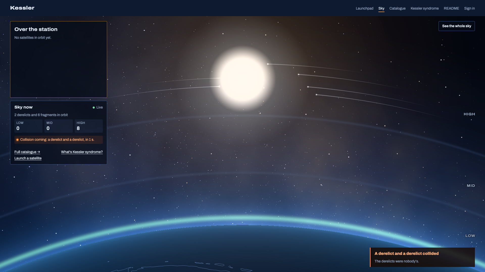

Checked in Chrome against a seeded sky (two derelicts sent to meet in the
high band, 57° from the station): at 1920x1080, before, mid-turn, the flash,
the sparks and the return to the station; and on an iPhone 14. Found on the
way: the collision layer never got the device pixel ratio, so on a retina
screen its rings were drawn at half size. `pnpm check` green. Committed as
`90dfab9`.

## 2026-10-07 — C9: the "in orbit" notice, and nudging towards a handle

The sky's "*callsign* is in orbit" notice outlived its satellite (on a
phone it stays in the page); it now goes as soon as the satellite is hit or
burns up. Checked by launching in a seeded sky and sending a derelict at it:
the notice showed until the hit, then went. Committed as `811236f`, then
`C9` was fast-forwarded into `main` and pushed (Advay's say-so), which
deploys.

Advay wanted to nudge people to sign up when they launch. Kept to a nudge,
never a gate (ADR 0009: anyone can launch), and not a pop-up on the Launch
button, which would cut into the launch animation: a line under the button
("Launching without a handle. Claim one to keep your satellites on any
device, and your name on what they do", or "Launching as *handle*"), and
the same offer on the notice straight after launching, which then stays up
twice as long on desktop. Tests in `spec/operator.test.ts`. Committed as
`487f0a4`.

## 2026-10-07 — C9: the handle nudge becomes a pop-up on the launchpad

Advay didn't think the line under the Launch button was enough, and wanted a
pop-up on the launchpad. It opens on arrival (a modal `<dialog>`), before
anything is launched, so it doesn't cut into the launch animation, the
reason a pop-up was turned down last time. It says what's lost without a
handle (your satellites are tied to this browser) and what one gives (they
follow you, and collisions name you), with "Claim a handle", "I have one:
sign in" and "Launch without a handle", which just closes it: still a nudge,
never a gate (ADR 0009). Escape or a click on the backdrop closes it too.

Once a visit (sessionStorage, marked when shown, so following a link to the
operator page and coming back doesn't bring it up again), never for someone
with a handle, and not when the form comes back with errors. Without
JavaScript it stays closed and the line under the button still makes the
offer. Test in `spec/operator.test.ts`, failing first against the old page.
Checked in Chrome at 1920x1080 and iPhone 14: it opens, focus lands on
"Claim a handle", closing works and a reload doesn't reopen it.

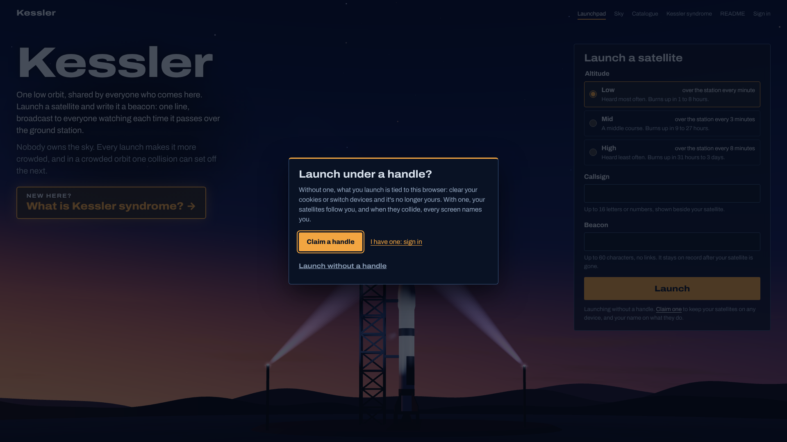

## 2026-10-07 — C9: what's outstanding, and the last two decisions accepted

Asked what was outstanding for C9, the agent went through `PLAN.md`, the
log and the repo (the course site was blocked from its sandbox, so not
against the spec itself): no `reflections/crit-9.md`, `PROCESS.md` stopping
at C8, a README still describing C8 ("one live satellite each"), ADRs 0009
and 0010 still proposed, a stale status section in the plan, the last log
entry missing its hash, and deorbiting not built. The plan's status and
the hash were fixed first (`408d5f7`, pushed to `main` on my say-so).

After the agent read me both records, I accepted ADR 0009 (an operator you
can claim) and ADR 0010 (every screen names who caused a collision, the C9
decision about several people at once). The README rewrite is low priority:
I'll write it near the end of the project. Next for C9: the C9 part of
`PROCESS.md`, `reflections/crit-9.md`, and whether to build deorbiting.

## 2026-10-07 — C9: bringing a satellite down, and boosting it up a band

Asked for both (branch `claude/c9-outstanding-work-17iuus`, on top of the
handle pop-up from PR #2, which GitHub wouldn't let my own account approve,
so it's merged into the branch rather than into `main`). **Deorbiting**: a
gradual descent, and a dialog thanking whoever does it for being
responsible. **Boosting**: keep a satellite up longer by climbing a band
(low to mid, mid to high), gradually. Buttons on your satellites on the
launchpad and in the sky's station panel. I also want to be able to click a
satellite or fragment to see its history, for C9 but not yet: noted in
`PLAN.md`.

The agent's design, in ADR 0011 (proposed, for me to accept): a manoeuvre
is a new epoch for the orbit with its own rate of fall, so positions stay
closed form (ADR 0007) and every screen draws the same descent. Brought
down: from any height it reaches the top of the atmosphere in two minutes,
then burns up as anything does, and ends `deorbited`. Boosted: it climbs to
a random height in the next band in 90 seconds, then falls by drag alone;
each satellite has fuel for one boost, so it buys a band, not immortality.
Every manoeuvre is kept in a new `manoeuvres` table, for the history view.

The snag was collisions: the server predicts meetings on the rule that two
orbits falling at one rate never get closer in height. A manoeuvring orbit
moves through other heights, so `nextMeeting` now works in pieces: where
two objects fall at different rates their heights cross once, and the
stretch either side where they're within the hit distance is found by
bisection. Plain pairs go through exactly the same steps as before, so old
skies replay the same. A manoeuvre throws away the object's predicted
meetings and works them out again; everyone gets a `manoeuvre` event, so
screens drop the collisions called off. A boost can take you out of a
collision coming, which is a taste of C10's dodging.

Tests first (`spec/manoeuvre.test.ts` for the maths,
`spec/manoeuvre-server.test.ts` for the server, `spec/manoeuvre-http.test.ts`
over HTTP), each failing for the right reason before the code. Found on the
way:
- **`pnpm check` was flaky before this work**: the first stream on a fresh
  server could get a staged collision's `launch` events before `hello`
  (the adversarial review's item 10). The stream now holds what the
  snapshot sets off until after `hello`.
- My own test had the wrong crossing time (the lower orbit decays too).
- On the sky page the background post went nowhere: the buttons are named
  `action`, so `form.action` was the button, not the URL.
- Capturing the clock before `nextLaunchAt` (which reads it again) gave a
  brand-new visitor "You can launch again in 1 s" and a disabled form
  whenever the millisecond ticked over in between. Caught by an existing
  test failing one run in three.
- The launchpad's "Yours in orbit" line became a list (one row each:
  callsign, where it stands, its buttons); the old launch test's exact
  wording was updated to the list.

Checked in Chrome at 1920x1080 and iPhone 14: boosting HERON from the pad
("Climbing to the high band"), bringing QUIET-SKY down (asked first, then
thanked), watching both on the sky (HERON's trail curving outward,
QUIET-SKY spiralling in and burning up at the limb, ended `deorbited`
150 s after the order), and bringing HERON down from the station panel
without leaving the sky. On the phone, the list no longer scrolls inside
itself. `pnpm check` green three runs in a row (185 tests).

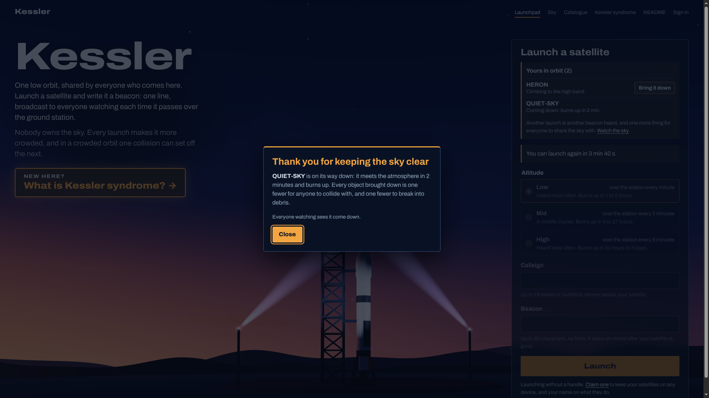

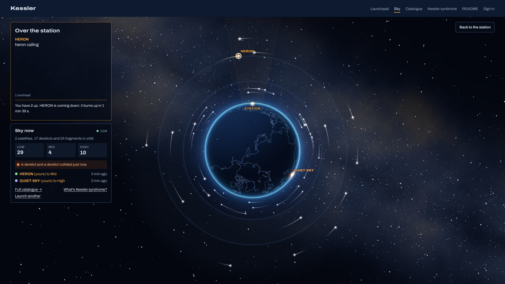

Committed as `948998e`. Then a fresh Sonnet reviewer, with no shared
context, attacked it against the ask and the ADR. It checked the maths
itself: 12,000 random plain pairs met exactly as before the change, and
about 1,700 meetings checked against a brute-force scan of descents and
climbs found no mismatch. It also confirmed cross-site posts are refused,
`back` can't redirect off the site, and the stream leaks no owner.
Fixed from its findings:
1. **The sky panel could bring down a different satellite from the one
   you confirmed**: the panel moves on to whichever of yours is next
   overhead, and the form was read after the question. It's read at the
   click now.
2. **The catalogue's live height went wrong after a second** for anything
   manoeuvring (its script rebuilt the orbit without the rate); it now
   carries the rate and the climb's end, and a live row says "coming down"
   or "climbing".
3. The dialogs overpromised ("won't be up there for anyone to collide
   with"): a satellite coming down can still be hit for two minutes, and
   now they say so.
4. A satellite that can't boost says why ("Boost used", "Highest band").
5. The launchpad list keeps up (climbing, coming down, burning up, gone)
   and the address loses `?deorbited=` once it's been said, so a reload
   doesn't thank you twice.
6. A boost gets a news line on the sky too, and a boost from the top of a
   band can't land just over the edge of the next.
Tests added: the catalogue's wording, the missing boost's reason,
cross-site posts, `back`, and an operator manoeuvring from a second device.
Not fixed: "next over the station" estimates from the period now, so it's
rough mid-manoeuvre; with several satellites the sky's panel offers its
controls for the one it's talking about, not a choice (the launchpad has
them all). `pnpm check` green (190 tests).

## 2026-10-07 — C9: manoeuvres off the launchpad; one boost, for sure

After seeing the screenshots, I didn't want satellites managed on the
launchpad: it was getting cluttered. It's back to the one line naming yours
in orbit, and boosting and bringing down live in the sky's station panel
only (which now says "Boost used" or "Highest band" when there's no boost).
The manoeuvre form always goes back to the sky. ADR 0011 (still proposed,
so editable) says so.

I also wanted to be sure a satellite can only be boosted once. It already
was (one tank of fuel per satellite, checked before the boost), and now the
database write checks it too, so two requests at the same moment, or from
two devices signed in as the same operator, still boost once. New HTTP
tests for both, and for the launchpad offering no manoeuvres; the rest of
the HTTP tests moved from the launchpad to the sky panel and the
catalogue. `pnpm check` green (190 tests).

I accepted ADR 0011 (bringing your satellite down, or boosting it up a
band) as it stands after the launchpad change. The manoeuvre commits so
far: `948998e`, `e010756`, `f35f752`.

## 2026-10-07: the handle pop-up opens on Launch, not on arrival

The pop-up asking whether to launch under a handle opened as soon as the
launchpad loaded, before anyone had decided to launch anything. It now
opens on the first Launch of a visit instead: the submit is held, and
"Launch without a handle" carries the same launch on (Escape or the
backdrop just closes it, so you can change your mind). Once shown it isn't
shown again that visit. Without JavaScript it never opens, as before, and
the line under the Launch button still makes the offer. Checked in Chrome:
closed on load, open on Launch, skip launches, Escape doesn't, second
Launch goes straight through. `pnpm check` green (190 tests); the timing is
client-side, so the HTTP spec suite can't see it. Commit `6f78d9a`.

## 2026-10-07: every object's history, and what the project is for

Advay's last C9 item was "click a satellite or fragment to see its
history". Before building it we talked about what it's *for*. The framing
we settled on is "the sky remembers": the README already leans on Ostrom (a
commons survives when its users can see the resource and what each of them
takes), and the sky only showed the first half. A history is where anyone
can see what one launch took. Kessler syndrome is a cascade, so most of a
launch's cost is downstream of it; the plan's first sketch only looked
back (who launched it, where debris came from). Advay agreed to three
things, now ADR 0012 (accepted):

- a history tells **what followed** as well as where it came from: the
  fragments that trace back to it, how many are still up, and what they
  went on to destroy (the blame of ADR 0010, read forwards);
- a flying satellite's **beacon stays withheld** (heard only over the
  station, with a countdown to its next pass), so "be seen" still means
  flying over the station; once it's gone the beacon is shown in full as
  its epitaph ("What it said" on the page; "epitaph" needed explaining, so
  the UI doesn't use the word); its owner always sees their own;
- for live objects, when it next passes and when it burns up.

Built: `historyOf` in `src/lib/sky.ts` walks the lineage forwards (no data
model change); `/object/<id>/` renders it without JavaScript, and
`/object/<id>/panel` is the same as a fragment for the sky. Clicking an
object in the scene (nearest drawn point within 22 px, 32 px for touch)
opens it in a panel down the right of the scene (under it on a phone),
with a wider ring on the chosen object; it refreshes on any collision,
since a cascade can add to what followed. Catalogue names and the sky's
latest launches link to it. `untilOverhead` moved from the sky script to
`orbit.ts` so the server can say when the next pass is.

TDD: two server-side tests on a staged collision and cascade (what ALPHA's
debris destroyed, a fragment's roots, CHARLIE destroyed by debris, a live
beacon withheld from all but its owner) and four HTTP tests (the page, the
owner's view, 404s, links), red first for the expected reasons. `pnpm
check` green (196 tests). Checked in Chrome at 1920x1080 and iPhone 14
against a scratch database with a staged cascade: the panel opens from a
click in the scene and from the latest launches, and the fragment and
victim histories read right.

Adversarial review (fresh Sonnet agent, against ADR 0012 and the spec).
What it found, and what changed:

- **The beacon rule is a presentation rule, not a secret.** `/sky/` and the
  event stream already send every live beacon so the station can show it,
  so "withheld" in a history doesn't stop anyone reading page source. Kept
  the rule (it's about the game: you hear a beacon by watching the
  station), and made ADR 0012 and the test comments say honestly what it
  is. Edited ADR 0012 in place because it hadn't been committed yet.
- **Screen readers would hear the countdown every second.** The panel body
  was an `aria-live` region and the countdown ticks inside it. Removed;
  a separate status line announces "History of X opened" once.
- **A refresh could overwrite a click.** A collision arriving while a new
  history loaded re-asked for the old one and dropped the new answer. The
  panel's object is now set on the click.
- **Focus.** A refresh kept focus in the panel, and closing went back to
  the link that opened it (found again by address, since the latest
  launches are rebuilt). A failed load now says so.
- **Misleading wording.** A victim's history read "3 fragments trace back
  to it", which is blame language for something debris destroyed (ADR
  0010). It now reads "The collision left 3 fragments. That wreckage went
  on to N more collisions, destroying …", with each loss linked to its own
  history (eight at most).
- **The walk did a full scan of collisions per lineage member.** It now
  reads every collision and fragment once and walks in memory (two queries
  in all).
- `/object/0117/`, `/object/117.0/`, `/object/0x75/` all rendered object
  117; ids must now be plain digits (tested).
- New tests: the panel route for a stranger vs the owner, and the
  non-canonical ids. Not acted on: pinning the cascade's exact collision
  count in the server test (it depends on seeded fragment orbits, so it
  would be brittle), and checking picking in the zoomed-out view (it uses
  the same view bounds as the labels).

`pnpm check` green (197 tests), against a fresh build. Commit `93f8735`.

Advay asked for a CLAUDE.md rule after I found port 8080 held by a server
from another worktree: only kill servers you started, checking uptime
(`ps -o etime`) and working directory (`lsof -d cwd`) first, and use
another port otherwise.

## 2026-10-07 — C9: slower orbits and three ground stations

I thought the satellites went round too fast, and wanted the beacons to be
the point of the sky page rather than the scene. Checked first: a beacon is
heard within 12° of the station, so a low satellite's beacon was on screen
for about **four seconds**, barely enough to read 60 characters. I'd also
wondered about dropping the globe view; we kept it, because with more than
one station the globe is the only view that shows them all, and it's where
most collisions and cascades are seen.

Decided, and written up as ADRs 0013 and 0014 (proposed):
- **Every period three times longer** (low 3 min, mid ~8, high 24): a low
  beacon is up ~12 s. Head-on collision chance tripled (2% → 6%) so
  collisions per hour stay about the same; decay untouched; trails drawn
  for 36 s so they keep their length. Orbits already up are **retimed
  once, in place**, on the server's first settle (new epoch now, new period
  for the height), so the deployed sky slows without anything jumping.
- **Three ground stations, like NASA's Deep Space Network**: Canberra,
  Goldstone, Madrid, all heard by everyone, so the shared moment stays. The
  three real sites lie within 8° of one great circle, so the chart's orbit
  plane is that circle and each station sits where its site projects (90°,
  −23°, −105°): uneven gaps, as the real network's are. The coastlines are
  re-baked in that frame, so each station sits on its own coast (same file
  size as before).
- **The sky opens on the whole planet**, with the three windows drawn and
  named; buttons switch to the horizon over any station (the old zoom,
  turned). After a launch it opens over Canberra, where the launch camera
  ends. "Over the station" became **"Beacons"**: a row per station, beacon
  in larger type, taking turns when several are overhead, otherwise what's
  next and when.

Tests first: the period law, the stations (where they are, which window a
satellite is in, the next one it reaches either way round, nothing heard on
the way), retiming against a throwaway database (continuity, same burn-up,
plunges and new-law orbits left alone, idempotent), staged collisions over
any station, and the sky page's panel and view buttons (whole sky by
default, Canberra after a launch). `pnpm check` green (203 tests).

Checked in Chrome at 1920×1080 and iPhone 14: one fix from it, the station
windows ran as beams to the edge of the screen when zoomed out; they now
fade just past the high band. Console clean.

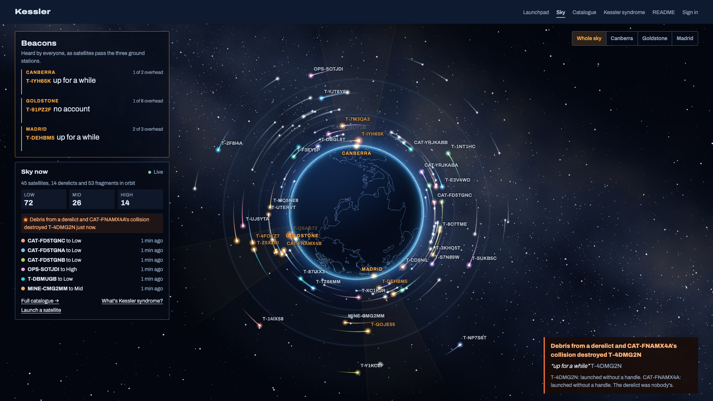

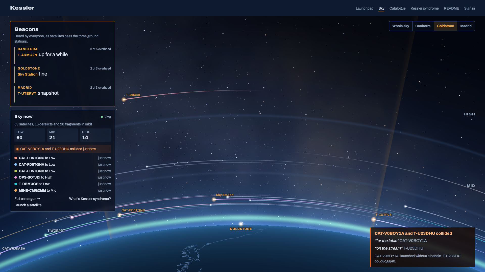

Then a fresh Sonnet reviewer, with no shared context, attacked it against
the ADRs and the spec, with brute-force checks of the maths in node and the
live app at five widths. Fixed from its findings:
1. **"Next: X, in −18 s"**: the time until a station was refined from the
   period, which collapses in a satellite's last laps; about 1% of calls
   near burn-up came out negative or promised a pass that never happens.
   It's now found by halving the time to burn-up on the unwrapped angle,
   which only ever grows. New brute-force test over 400 orbits in their
   last laps (it failed first, at −995 ms).
2. The performance harness clicked the old `#zoom` button; it now opens on
   the whole sky and clicks Canberra.
3. Retiming marked itself done before it ran, so a busy disk would have
   left old orbits three times too fast for good. Now marked after.
4. Beacons taking turns used the local clock, so two screens could show
   different lines at once; now the server's.
5. A 60-character beacon was clipped on a phone; rows there have room for
   three lines.
Also: retime tests for a climb under way, a finished climb, a descent and
an orbit not up yet; a staged collision over Goldstone; the canvas's label
says Canberra when it opens there; a station name measured while hidden is
measured again when it shows; ADR wording (what each supersedes, "head-on"
collisions per hour, what retiming does to which meeting is fatal, "by its
own coast"); stale "the station" comments. Not done: a "recently heard"
list, a button from your satellite's line to its next station's view,
fewer live-region announcements when several take turns, and pulling the
panel's logic out of the page script for unit tests. `pnpm check` green
(206 tests).

I reviewed it on the dev server and accepted ADRs 0013 and 0014. One
problem I found: on my laptop (about 1512×757) "Sky now" ran off the
bottom of the first screen and needed a scroll. The Beacons panel is
taller than the old station panel, so the breakpoints that drop parts of
the summary on shorter screens no longer fit. Measured the overflow at
heights from 544 to 1080 px with a three-line news item (the worst case):
it was 47 px over at 757. The beacons' note is one line now, the
summary drops its latest launches below 800 px and its counts below 720,
the beacons drop their note below 656, and below 608 the beacon type is a
step smaller and the count line goes. The beacons themselves always
stay. Fits at every height measured.

Merged `main` (object history, ADR 0012, `93f8735`) into this branch.
Both had written an ADR 0012, so ours moved up: **0013 slower orbits, 0014
three ground stations**, every reference renumbered by hand (main's 0012
references left alone). Main's history code still used the one station's
`isOverhead`/`untilOverhead`, which this branch removed: it now uses the
three stations, so a flying satellite's history says "It's over Goldstone
now" or "Next over Madrid in 42 s", and `History.nextPassAt` became
`nextPass` (when, and which station). Kept both sides of the sky page:
the view buttons and the Beacons panel with click-to-pick and the history
panel (which sits under the view buttons). Main's "click anything" hint
adds two lines to Sky now, so the short-screen breakpoints were measured
again with a three-line news item: the latest launches drop to three below
960 px and go below 864, and the hint goes with the beacons' note below
656. Fits at every height from 544 to 1080. `pnpm check` green (213
tests).

## 2026-10-07 — Plan tidied after PRs #3 and #4

Checked what's left for C9 (cutoff Mon 12 Oct, 12:00): nothing to build,
only the write-ups (`PROCESS.md`'s C9 part, `reflections/crit-9.md`) and a
`pnpm check` plus preflight before the cutoff. Brought `PLAN.md` up to date
to match: deorbiting/boosting, object history and the three stations moved
into "built" with their hashes; boosting no longer "shelved"; conjunction
alerts and fuel moved to C10 everywhere; open questions that ADRs 0008,
0010, 0012 and 0013 had already settled (collision radius, who sees the
blame, the couplet, beacon epitaphs, Three.js) struck through or rewritten.

Commit `d0c90a8`.

## 2026-10-07 — Launchpad: a draft that survives signing in, a rocket that holds still

Two things noticed on the launchpad.

**Signing in from the pop-up lost the launch.** Fill in the form, press
Launch, follow the pop-up to claim a handle or sign in, and you landed on
the operator page; back on the launchpad the band, callsign and beacon were
empty. Now the pop-up's links (and "Claim one" under the form) go to
`/operator/?back=launchpad`, both operator forms carry `back` through, and a
successful claim or sign-in redirects to `/` instead of `/operator/`. `back`
is a whitelisted token, not a URL, so it can't send anyone off-site (tested
with `https://…`, `//…` and `/sky/`). The launchpad saves what's filled in to
`sessionStorage` when you follow any link to the operator page, and fills it
back in once on the next load, never over a refused launch's own values; a
back-button return from the cache drops it. Tests first in
`spec/operator.test.ts` (failed on the pop-up's plain `/operator/` link).
Checked in Chrome: Mid / callsign / beacon, Launch, claim from the pop-up,
landed on `/` as the new handle with all three restored; a reload after
that starts empty.

**The rocket grew as you scrolled.** Its height is the room between the
bottom of the intro text and the ground, measured in viewport coordinates
and re-measured on scroll, while the canvas is fixed. At 1512×757 the page
scrolls 62 px, so the rocket swelled from its 9rem floor as the intro moved
up, then shrank back: the "old rocket" flashing in. It now measures the
intro where it sits unscrolled, so scrolling doesn't change it. That same
measurement is why the rocket looks further away than it used to: the
"What is Kessler syndrome?" button took the room under the intro, pinning
the rocket at its 9rem minimum on a laptop. Screenshotted 9, 12.5, 16 and
20rem at 1512×757 and 1920×1080 for a decision; I chose 20rem. The rocket
is now at least 20rem (more where there's room under the intro, up to the
old 26rem cap), but no wider than the ground between the intro and the form
and no taller than the screen under the header, so at 900 px wide it still
shrinks to fit. Checked at 1512×757, 1920×1080, 1280×720, 1366×600, 900×700
and iPhone 14 (the phone's gutter rocket is unchanged). `pnpm check` green
(215 tests).

Commit `c83719d` (with the other two changes and the review fixes).

## 2026-10-07 — The sky explains itself after your first launch

Asked for: on arriving at the sky after someone's first launch, a dialog
that briefly says how it all works. "First" is decided on the server:
`isFirstLaunch(who, id)` in `src/lib/sky.ts` is true when the launched
object is the earliest satellite the person (or their operator) ever
launched, up or long gone, so it's once per person, not per browser visit,
and a second launch never gets it. `src/components/FirstLaunch.astro`
renders open (works without JavaScript, like the deorbit thank-you), and
the script makes it modal, starts focus on "Watch it fly", and drops
`launched` from the address on close so a reload doesn't repeat it. Six
short points in a two-column grid (one column on a phone, scrolling inside
the dialog): it's heard at the three stations; it falls to atmospheric drag (hours low, days
high; the beacon stays on record); it can collide, into debris, a Kessler
cascade, and every screen names whose satellites; launch again in 5
minutes, sky holds 200; boost once; or bring it down in 2 minutes, put
as the responsible way to finish (wording asked for after the first look). Ends on
where the controls are and "your mark on the sky", with a claim-a-handle
link if anonymous. The figures come from `LAUNCH_GAP`, `SKY_CAP` and
`MANOEUVRE`, not typed in. Tests first: an HTTP test (open after a first
launch, covers each point, closable, absent on a plain `/sky/` and for
someone else following the same link) and a server test (true for the
first, false for a second after the first burned up, false for another
person). Checked in Chrome at 1920×1080 and iPhone 14 via a real launch;
fixed autofocus scrolling the phone dialog to the bottom. `pnpm check`
green (217 tests).

Commit `c83719d` (with the other two changes and the review fixes).

## 2026-10-07 — Adversarial review of the three launchpad/sky changes

A fresh Sonnet reviewer, told to be adversarial, read the uncommitted
rocket framing, draft-through-sign-in and first-launch explainer against
the code, ADRs and spec. What it found and what changed:

1. **`back=__proto__` broke the redirect after a successful claim**
   (`BACK[back] ?? …` on a plain object returned `Object.prototype`, so
   `Location: [object Object]`). Not an open redirect, but not the
   whitelist claimed either. `BACK` is a `Map` now; the test tries
   `__proto__`, `constructor` and `toString` too.
2. **The explainer stripped `?launched=` on load, not on close**: the
   script closed the no-JS dialog to reopen it modal, and that `close`
   event (queued, so it reached the listener added after) ran the
   clean-up. I'd seen the bare `/sky/` while it was open and not followed
   it up. Now an inline script removes `open` as the dialog is parsed (no
   close event, no flash) and the page script opens it modal later.
3. **It covered the launch's arrival, and the notice's timer ran out
   behind it.** It now waits until the sky is drawn (or can't be, or 4 s)
   plus 1.5 s, and the "in orbit" notice starts its fade once the
   explainer is closed.
4. **Focus went straight to "Watch it fly"**, so a screen reader skipped
   all six points (and on a phone it scrolled to the bottom). Focus starts
   on the heading now; the scroll fix is gone. A text selection ending on
   the backdrop no longer closes it.
5. **The sky's "Claim a handle" links didn't come back**: the notice's and
   the explainer's go to `/operator/?back=sky`, which returns to `/sky/`.
6. **The saved draft was too eager**: any operator link (the header's too)
   saved it and any later launchpad load restored it. Now only the
   launchpad's own `back=launchpad` links save it, and it's restored only
   when arriving from `/operator/`, else dropped. Checked in Chrome: the
   header link saves nothing, a detour elsewhere drops it, the claim round
   trip restores it.
7. **Copy against the code**: beacons aren't sound ("plays" → "is
   broadcast"); mid→high adds about a day, not days ("a day or two more");
   bringing it down now says it can still be hit on the way, as the
   confirm dialog does; "200 satellites" (debris doesn't count); "shows
   who launched what collided" (anonymous ones aren't named); the boost
   count comes from `FUEL`.
8. **Test gaps**: added an explainer for someone signed in (no handle
   offer), `isFirstLaunch` for an operator on a second device, the sky's
   `back=sky` links and redirect, and `back=launchpad` on "Claim one".
   Not added: a browser test of the draft (the spec suite is HTTP only;
   checked by hand instead) and a second launch over HTTP (five-minute
   gap; the server test covers it).

Left as is: the no-JS explainer shows again on reloading the same
`?launched=` URL (only the script can drop it), and the rocket's 20rem
gives way to the room between intro and form on narrow desktops (the
comment now says so). `pnpm check` green (220 tests).

Commit `c83719d`.

## 2026-10-07 — Overnight round: Advay's feedback, and the plan for it

After playing with the app, I left a list for the agent to work through
overnight (branch `claude/nifty-thompson-s7cine`, in a worktree; a PR for
me to review in the morning):

- the catalogue should have a section for just me, with my satellites'
  management (boost, bring down) in it;
- take boosting and bringing down out of the sky page: with several of
  mine up, the station panel's controls are for whichever passes next, which
  makes no sense;
- longer beacons, shown better, more like a social app. This is the one
  that worries me: it's starting to feel less like a unique, thought-
  provoking social thing and more like a web app visualising Kessler
  syndrome;
- the purpose, the "why", needs fleshing out a lot more;
- an object's own page is mostly empty space: make it a pop-up dialog with
  all its info, and the boost/bring-down buttons if it's mine;
- "make messages that collide more meaningful, give them a connection":
  the marker raised it too, and the couplet hasn't met it. Explore it
  properly and build something meaningful;
- bug: pressing Launch with nothing filled in opens the sign-up nudge.

The agent's plan, in the order it's building them (each its own commit,
pushed to the branch as it goes):
1. the bug;
2. an object's history as a dialog, with your own satellite's controls in
   it; a "Yours" section in the catalogue; no controls in the station panel
   (a new ADR, since ADR 0011 put them there);
3. longer beacons, and the sky page's beacons as a social feed: what each
   station is hearing now, and a running list of what's been heard, with how
   many people heard each one;
4. colliding beacons that break into each other: the wreck keeps the words
   of both, and keeps broadcasting them as static;
5. the purpose: being heard by real people at the same moment, a question
   from the stations each day, and the "why" said on the launchpad and in
   the explainer.

Logged with the first fix of the round: commit `3b41406`.

## 2026-10-07 — The handle pop-up waits for a launch worth making

Pressing Launch on an empty form opened "Launch under a handle?", then
(after "Launch without a handle") came back refused. The pop-up's script
caught the submit before anything checked the form. It now runs the same
`readLaunch` the server does (it's shared code, `src/lib/launch.ts`) and
only steps in when the launch would get through: a missing callsign or a
linky beacon goes straight on to the server, which says what's wrong, as
before. The server still has the last word. When the pop-up does open, any
errors left from an earlier try are cleared first, since they've been
fixed. Checked in Chromium (agent-browser, 1920x1080): empty form, no
pop-up and both errors shown; filled in, pop-up, errors gone, and "Launch
without a handle" landed on the sky; a beacon with a link, no pop-up and
"No links". No spec test: the suite is HTTP only and this is the page
script. `pnpm check` green (220 tests). Commit `3b41406`.

## 2026-10-07 — Yours, and every object as a pop-up card (ADR 0015)

Three of my asks in one piece, since they share the controls: a section of
the catalogue for just me with the management in it; no boosting or
bringing down on the sky page; an object's own page as a pop-up with its
info and, if it's mine, the buttons.

Written up as ADR 0015 (proposed, for me to accept). It supersedes where
ADR 0011 put the controls and how ADR 0012 opened a history. The agent's
reasoning: the station panel's controls were for "whichever of yours is next
over a station", which changes under your hand once you have several up;
putting every control on one named satellite (its card) means there's never
a question of which.

- **Yours** is a third catalogue view, `/catalogue/?show=mine` ("Yours (3
  up)"): who you're launching as (handle, or this browser with a claim
  link), a card for each of yours in orbit (beacon in full, height, next
  pass and burn-up counting down, Boost to X / Bring it down, or "Highest
  band" / "Boost used"), then your whole record as the catalogue's table
  (status filter, no "Only yours" box since it's all yours). The global
  collisions list stays on the other two views.
- **Every object's history pops up as a card** (`<dialog>`), on the sky and
  the catalogue: any link to `/object/<id>/` opens it in place, so does
  clicking an object in the sky. Your own live satellite's card carries its
  controls. On the sky it sits down the right with the sky only lightly
  dimmed (a sheet from the bottom on a phone); elsewhere it's centred, and
  wide enough that its parts sit in two columns. The old history panel's
  care moved into the shared script (`src/scripts/object-card.ts`): a slow
  answer to an earlier click is dropped, a refresh doesn't throw focus out,
  closing goes back to the link that opened it (found again if the list
  was rebuilt), a text selection ending on the backdrop doesn't close it.
- **`/object/<id>/`** stays for a link opened on its own and for no
  JavaScript, now as the same card centred on the page (two columns when
  wide) instead of a narrow column down the left.
- **The station panel** offers no controls; it still says what yours is
  doing, with a "Boost or bring down yours" link to Yours.
- **Without JavaScript** each form carries `back` (`yours` or `object`, a
  fixed token looked up in a `Map`), and the server goes back there with
  the thank-you or the refusal; anything else goes to Yours. With
  JavaScript a boost or deorbit happens in place: the card and the Yours
  list are fetched again from the server, so the page never works out what
  the server already knows. A refusal is said beside the buttons that
  asked. The control styles moved to the global sheet, since the card's
  markup is fetched into pages that don't otherwise render the component.

Tests first (`spec/manoeuvre-http.test.ts`, rewritten around Yours and the
card): no manoeuvre forms anywhere on the sky page and a link to Yours; a
"Yours" tab; your card with both forms coming back to `yours`, your
beacon, "Boost to Mid"; nobody else's satellites in yours; the empty
state with a launch link; the high band's "Highest band"; the owner's card
(fragment and page) with the forms, a stranger's with none; deorbit and
boost without JavaScript landing on Yours (and on the object page with
`back=object`), thank-you open; `back` values `//evil.example/`,
`https://…`, `/sky/`, `__proto__`, `constructor` and empty all going to
Yours; a refusal coming back with its reason. Thirteen failed first for the
expected reasons. `pnpm check` green (227 tests).

Checked in Chromium at 1920x1080 and iPhone 14 against a busy scratch sky:
Yours with three of mine (low, mid, high); KESTREL's card from the list,
"Boost to High" in the card, and both the card and its Yours card switched
to "climbing to the high band" with "Boost used"; HERON's card from the
sky's latest launches, down the right; on the phone, the sheet from the
bottom. Fixed on the way: the card's countdown spans ran into each other
("115 km/h.Next over"), and the sky's card now covers the view buttons
rather than half-overlapping them (they're inert behind it anyway).

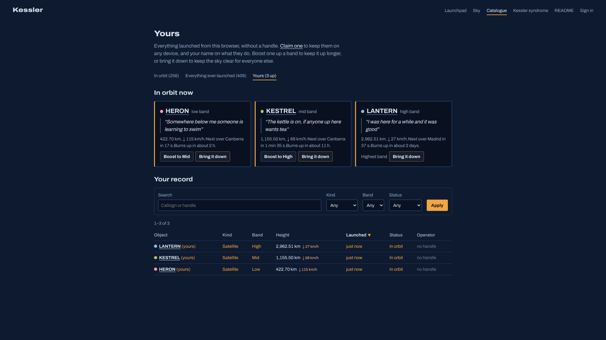

Commit `51e1fc0`.

## 2026-10-07 — Beacons heard by people: 140 characters, a feed, who's listening (ADR 0016)

The ask: longer beacons, shown better, more like a social app, because the
app was turning into a Kessler visualiser. The agent's read of why: the
beacon was meant to be the point, but it was a line of small type in a
corner, gone as its satellite left a window, and nothing said whether anyone
had been there to read it. Everything else on the sky page was physics; the
people were only in the callsigns. So three things, written up as ADR 0016
(proposed):

- **140 characters**, not 60: a thought, not a slogan, readable in the
  dozen seconds a low satellite is over a station (ADR 0013 made that
  possible). The beacon is a text box now, with a live "52 / 140" count.
  When several are overhead they take turns sized to the line (4 to 10
  seconds, `src/lib/airtime.ts`), still by the server's clock.
- **Heard by people.** Listening is having the sky open (its event stream).
  The server counts **people, not tabs**: each stream is tagged with its
  operator, or a one-way hash of its cookie (the cookie isn't stored again).
  Every second, while anyone is listening, the server works out in closed
  form what came into a station's window since its last look
  (`src/lib/heard.ts`); each such pass is a **transmission** (logged with
  station, time and how many heard it), and each listener who isn't the
  owner is recorded once per satellite. "Heard by" is how many different
  people that is; the owner can't raise their own. A pass with nobody
  listening isn't heard and leaves nothing behind. Everyone is told
  (`heard`), and how many are listening (`audience`). New tables
  `transmissions` and `listens` (migration `0005_heard`).
- **A feed.** The sky page has a column beside the sky (under it on a
  phone): "Beacons" (the three stations live, as before, plus "You and 2
  others listening"), then **Heard**: each beacon picked up while someone
  was listening, latest pass first, as a card with who launched it, the
  line, the station, when, "Heard by 3 people · 5 passes", and Burned up /
  Destroyed once it's gone. A new pass moves its card to the top with a
  flash. It's server-rendered, so it reads without JavaScript. The
  summary ("Sky now") stays over the sky on the left; the object card
  became a drawer over the column. Histories and the cards in Yours say how
  many have heard it.

The bigger shift, said in the ADR: a beacon that's been heard is now
public in the feed while it still flies (ADR 0012 withheld it until it was
gone; a history now shows it once it's been heard). So the altitude
trade-off moves from visibility to audience: a low satellite passes a
station every minute or so, gets heard by more of the people who come and
go, and keeps returning to the top of the feed.

Tests: server tests on throwaway databases (`spec/heard-server.test.ts`,
13: heard by everyone listening and logged; the owner not counted; owner
alone logged with nobody else; each person once over a whole lap of three
stations; nobody listening, nothing logged; only from launch; a satellite
burning up first is never heard; derelicts silent; the feed's order and
fields; your own marked with nobody's owner leaked; a history's beacon
withheld until heard; tabs counted once; an operator one listener on any
device, and no cookie kept). These were written before `heard.ts` existed
but only run once it did, so their first red was "module not found", not
each assertion. `spec/airtime.test.ts` for the turns; HTTP tests for the
140 limit (141 refused and kept in the form, 140 taken), the column and
feed on the sky page, and `heard`, `heardBy` and `listening` in the
stream's hello. One run against a crowded scratch sky (about 260
satellites left by earlier runs) failed "a second boost is refused for
fuel", most likely because the satellite was destroyed in between; two
runs against a fresh database were green. `pnpm check` green (245 tests).

Checked in Chromium at 1920x1080 on a fresh database with the test runs'
satellites up: after 40 seconds listening, the feed had filled with cards
("Over Madrid · Heard by 1 person · 3 passes"), and the column held the
three stations and "Just you, listening".

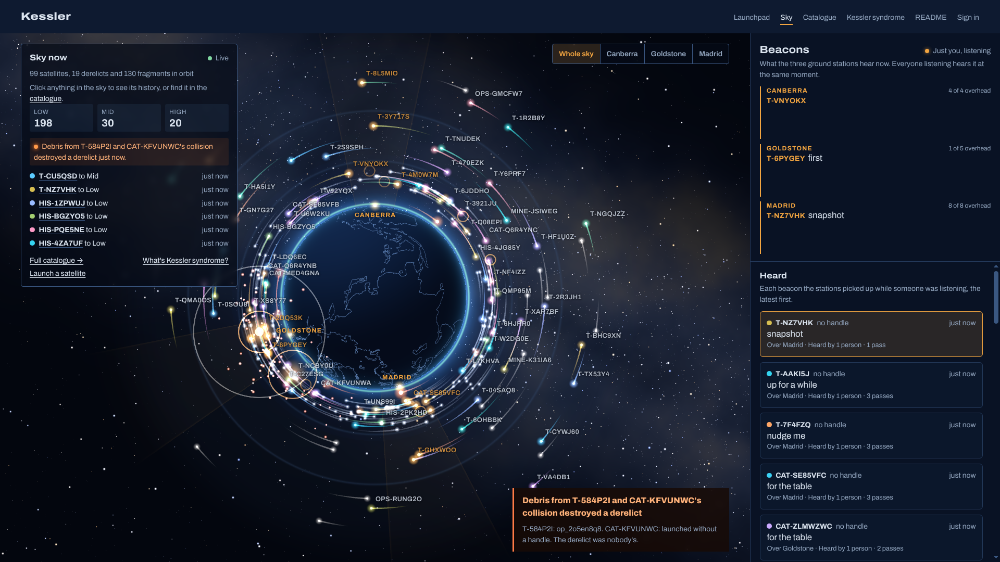

Commit `e0db217`.

## 2026-10-07 — Collisions that mean something: the wreck keeps the words (ADR 0017)

My ask (and the marker's): make colliding messages meaningful, give them a
connection; the couplet hasn't done it. The agent laid out what it found
wanting in the couplet: it frames a random pairing and then nothing
changes; both lines die with their satellites, the fragments are
anonymous, and the two people never learn anything of each other. It's
the one moment two strangers' words touch, and it leaves no mark on
either.

Options weighed (all in ADR 0017, proposed): the couplet as built; aiming
a "reply" launch at a satellite (rejected again: it makes collisions
chosen, which breaks the argument, and drifts towards Constellation);
colliding by meaning (the server judging text, opaquely: a trick); and four
that work together, which are what's built:

- **The wreck keeps the words.** Each fragment carries a shard: a run of
  words from one side's line and a run from the other's, joined by " … ".
  Each line is cut into as many runs as there are fragments, in order, so
  every word survives once; one side's runs are dealt in order, the
  other's shuffled, seeded by the two ids, so a replay after a restart
  makes the same shards (`src/lib/wreck.ts`). Read in order, the wreck is a
  cut-up neither person wrote. A derelict says nothing, so a satellite
  hit by one is scattered alone, still in order. Cascades carry it on:
  debris's own shard is re-cut when it destroys a third satellite, so
  words travel down the lineage as text. Every shard goes through the
  word filter (dropped if it fails).
- **The wreck keeps talking.** A fragment with words is heard over the
  stations as **static** (marked STATIC, flickering, ░ either side), taking
  turns with the beacons, logged and in the Heard feed ("Static · from MOTH
  and LANTERN's collision"). So a crash puts noise made of two people's
  words into the stations, and a cascade fills them with it: crowding
  costs everyone airtime as well as satellites.
- **The wreck falls silent as the sky heals.** "The wreck says …" lists
  every fragment's piece in order; the ones whose fragment has burned up
  are faded and struck through, so a collision's words go quiet one by
  one as decay clears the orbit. On the sky's collision card, the
  catalogue's collisions, the histories of the two that met, and a
  fragment's own card ("What it says").
- **An encounter.** Yours has an Encounters list: each collision a
  satellite of yours was in, what it met, what that person had said (or
  what the debris that destroyed it was carrying, and from whose
  collision), what yours had said, and what the wreck says now. A
  collision is the only way you meet a stranger here.

Stored as one nullable column, `objects.words` (migration `0006_words`).
Nothing reads meaning into the text; the connection is causal, as the plan
said it had to be.

Tests first: `spec/wreck.test.ts` (every word of both lines once, in order
on each side; a piece of each side per fragment; the same whichever way
round; a silent side; both silent; short lines; a cascade re-cuts a shard;
nothing the filter refuses, across combinations of spaced letters), and in
`spec/collision-server.test.ts` (ALPHA and BRAVO's fragments carry both
lines, the collision is told with its wreck; CHARLIE's fragments carry
CHARLIE's line and the debris's words; ALPHA's history has the wreck; a
fragment's history says what it carries; alice, bob and carol each have
an encounter naming the other side, carol's with the debris and its
roots) and `spec/heard-server.test.ts` (a fragment with words is heard,
one without isn't, and the feed calls it debris with its words). Six
failed first for the expected reasons; one test's assumption was wrong
(two short lines over six fragments leave some silent, and the one that
hit CHARLIE could be silent), so it now checks the encounter against
what that fragment carries.

The cascade-replay test (two hours of sky stepped 1,440 times) takes about
three seconds alone, on the previous commit as on this one, and crossed
vitest's five-second default once with the whole, now larger, suite
running beside it; it has a 20-second timeout now. `pnpm check` green
(256 tests), twice in a row.

Checked in Chromium at 1920x1080 by staging a head-on collision between
two people's satellites (MOTH and LANTERN, with real-sounding lines) on a
fresh scratch database. Two tries went wrong first, both informative: on
the busy test sky LANTERN was hit by silent debris before MOTH reached it
(its three fragments carried its line alone, in order: "To whoever reads
this: the / bakery on the corner closes on / Sundays now, so go on
Saturday"), and then by the derelicts the server stages for a watcher,
which fly at the same height my script used. At another height they met:
the card read "MOTH and LANTERN collided", both lines, and "The wreck says
To whoever … I keep a / list of every bird … go on Saturday / …", and a
minute later Goldstone's row was playing "STATIC ░ bakery on the … I've
seen from ░". Yours showed the encounter. Fixed on the way: the line under
the stations still said "MOTH is over Goldstone now" after MOTH was
destroyed (it only knew burn-ups); it now says it was destroyed in a
collision.

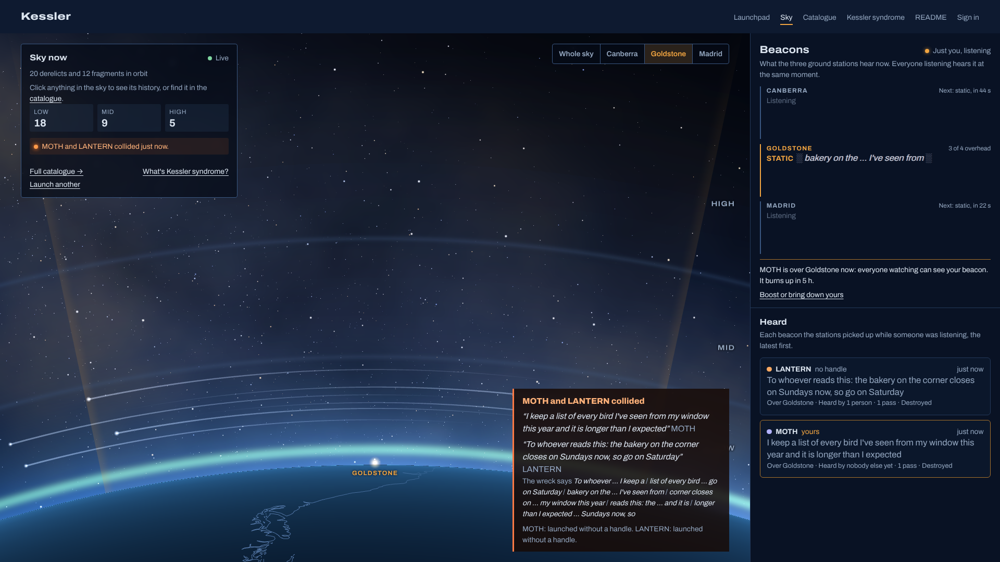

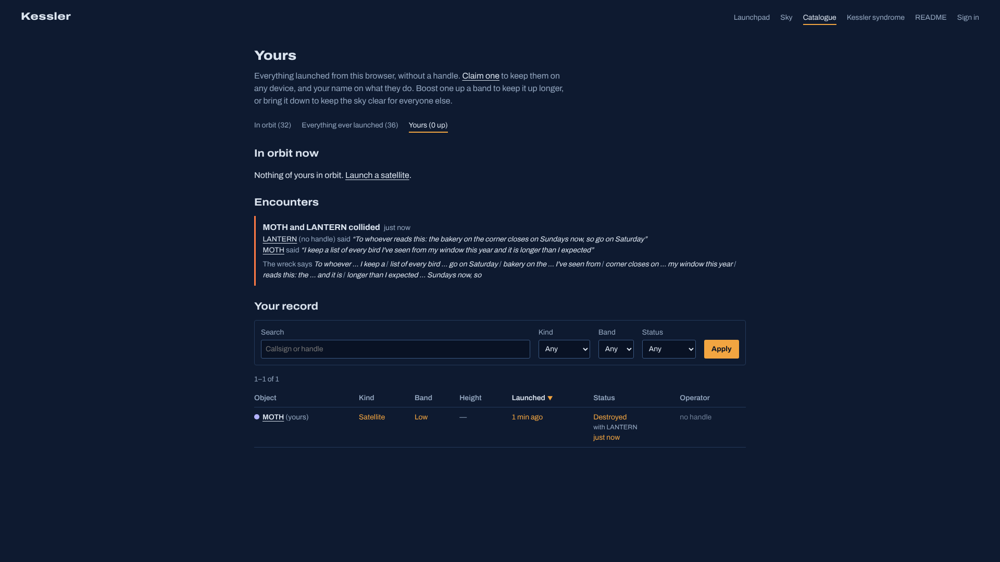

Commit `fd0a0df`.

## 2026-10-07 — The purpose: a question a day, and the why said plainly (ADR 0018)

My ask: flesh out the purpose, the "why", a lot more. The agent's reading:
the why has two halves, for a visitor (why launch, stay, come back) and
for the project (the argument), and the app only ever said the second;
nothing told a stranger what they were there to do besides "launch". Of
the three purpose ideas in the plan, two were now built (being heard,
counted: ADR 0016; debris eating airtime: ADR 0017), so this adds the third
and says the whole thing.

- **A question from the stations each day** (ADR 0018, proposed): a fixed
  list of 21 in `src/lib/questions.ts` for me to edit ("What do you want to
  outlast you?", "What should we all stop saying?", "Who do you wish were
  listening?"…), turning at midnight UTC. The launch form shows today's
  above the beacon with "It answers today's question" ticked; the form
  carries which day it showed, so a launch just after midnight answers the
  one it was written to (today's or yesterday's; older answers nothing).
  The satellite keeps the question's text (`objects.question`, migration
  `0007_question`), so editing the list never rewrites the record. Shown in
  the feed, histories, Yours, and today's on the sky's beacons column with
  "Answer it". Two answers to the same question that collide say "Both
  were answering …": a thematic connection on top of the causal one,
  without anything judging the text.
- **The why, said plainly.** The launchpad's intro now leads with what
  you're there to do and what it costs, and ends on the question the app
  asks: "What's worth saying, if saying it costs everyone a little?" Its
  big button goes to a new **Why** page (`/why/`, in the nav): what you do
  here (say one thing, listen, answer the question, decide what your words
  cost, meet someone the only way you can), what it's about (attention as
  a commons; Hardin, Kessler and Cour-Palais, Ostrom), and how it maps.
  The Kessler syndrome page's mapping now mentions being heard and static.
  The first-launch explainer says it's heard by the people listening, that
  a collision breaks it into static and Yours shows who it met, and that
  the controls are on its card and in Yours (it still said "under
  Beacons", stale since ADR 0015).
- `PLAN.md`: status for the overnight round; "The idea" and the core loop
  carry the words; decision rows for 0015–0018; "Collisions that mean
  something" and "A purpose" rewritten as decided ("What Kessler is for").

Tests first: `spec/questions.test.ts` (the list; same all day, next
tomorrow, round again; answered from today's or yesterday's form only, and
junk refused; `sharedQuestion`) was written with its module in one go, so
its red was a missing module; `spec/question.test.ts` over HTTP (the
launchpad's question, ticked box and day; the Why page linked and saying
heard/listen/question/collide/static/commons/worth saying; a launch
answering keeps it and its history says so; unticked or a week-old form
answers nothing; today's question on the sky with a way to answer it) went
red for the expected reasons (4 of 6; the two "answers nothing" cases
passed before anything existed). A server test stages two answers to the
same question colliding. `pnpm check` green (267 tests).

Checked in Chromium: at 1920x1080 the launchpad's new intro and form; at
1512x757 the form had grown past the first screen by 200 px (the question,
a three-line text box and the tick box), so the question went on one block
with its label, the box starts at two lines and grows with what's written
(`field-sizing`), the help text is shorter, and the band notes drop below
800 px tall instead of 736: it scrolls 75 px now, as it did 62 px before,
with Launch on the first screen. iPhone 14: intro and button fit, no
sideways scroll. The Why page at 1920x1080 (a missing space after the
quoted question fixed).

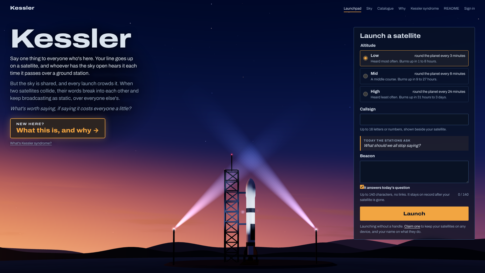

Commit `248469e`.

## 2026-10-07 — Two follow-ups: derelicts counted together, a bounded feed

Seen on the phone against a busy sky: static "from a derelict, a derelict,
T-ZV7T2S and 3 others' collision". `collisionOf` now names up to three
people, then "2 others", then the derelicts counted together at the end
("ALPHA and 2 derelicts' collision", "A1, B2, C3, 2 others and 2
derelicts' collision"); one person and one derelict reads as before. A
story test for it (written with the change). And the feed's query read
every transmission ever logged to find the latest per beacon; it now reads
only the latest 2,000 passes (by the time index), which is days of them at
a busy hour. Typecheck and the affected tests green (47); the full HTTP
suite waits for a rebuild after the adversarial review, which is using the
running server. Commit `e0b2562`.

## 2026-10-07 — Adversarial review of the overnight round (findings)

A fresh Sonnet reviewer, with no shared context, attacked everything since
`a52b08b` against my seven asks, the ADRs and the code, using curl against
the running build and its own server on another port. It confirmed some
things hold: pass detection matched a 50 ms brute-force oracle exactly over
600 s and 35 satellites; a 40-satellite cascade gave identical words on all
117 fragments whether run in one jump or in 5 s steps; `back` can't
redirect off the site and cross-site posts get 403; a beacon of
`</script><script>…` is escaped everywhere. What it found (acted on in the
entries that follow):

Must-fix:
1. **"Heard by" was inflatable.** A request with no cookie gets a fresh
   one, and its stream counted as a new listener: five cookieless
   `curl /api/events` streams took the owner's own satellite to "Heard by
   5 people". Hidden tabs counted forever; streams were uncapped. And the
   copy said "nobody can raise their own".
2. **Copy the code contradicts.** The Why page said bringing yours down is
   "taking your words back" (the record keeps them), "nothing is
   moderated" (there's a word filter), "heard by everyone all at once"
   (several overhead take turns); a live, already-heard beacon's history
   said "heard only as it passes over a station"; and the answering box,
   ticked by default, tagged lines like "Second launch, mid band." as
   answers, manufacturing "both were answering" connections.
3. **The feed and stations broke in a busy sky**, just when a cascade
   happens: 29 of 30 feed cards static, about four `heard` events a
   second, every card jumping to the top and flashing under the reader;
   "17 of 19 overhead"; one people's collision's fragments taking about
   40% of every station's airtime for hours.
4. **"Heard" was credited on entering the window, not on airtime**: with
   two long lines overhead, one could get no turn yet still count as
   "heard by N".
5. **Ask 6 mostly invisible in a real session.** Staged collisions are
   derelict against derelict (silent), and with a floor of 20 derelicts
   most real collisions involve one, so the encounter read "a dead
   satellite, nobody's, it had nothing to say" and the wreck was one line
   chopped up. A two-stranger collision needs two people's satellites to
   meet. Ideas: give derelicts a line, publish the wreck as one post,
   tell owners on their next visit.
6. **The card on the sky was modal**: it covered the beacons column and
   made the sky inert. `/object/<id>/` still left about 45% of a wide
   screen empty.
7. **Ask 3's worry isn't fixed by layout alone**: at 1512x757 the stations
   took about 600 px and the feed one card; on a phone "Sky now" sat
   under 30 cards; "no handle" on every card reads as a missing person.

Should-fix: tests that would pass with features broken (nothing covers the
server's one-second ear, the `audience` and `heard` events' shape, or
words surviving a replay; `typeof null === "object"`; a feed test that
loops over nothing); an operator test that failed on a dirty database
because a shard word was literally "owner"; a stations test timing out
under load; `publish()` dropping a broken listener without recounting the
audience; focus dropping to the page after a boost from a card; the
listener hash being unsalted (the owner cookie is stored raw anyway, so a
database holder could link owners to listening); the new tables
unbounded. Opinions: the Why page leans preachy in places; the question
turning at 10–11 am in Canberra suits the marker less than midnight
there. And a list of README claims now stale, for my rewrite.

## 2026-10-07 — Review fix 1: heard means on air, by people already here

Acting on the review's findings 1, 4, 9 and part of 3:

- **Heard means on air.** The stations' turn-taking is one shared rule now
  (`onAir` in `src/lib/airtime.ts`): each beacon overhead takes its own
  turn, and **all the static overhead shares one turn** between it (a
  fragment a cycle), so a cascade's fragments can crowd a station but
  never drown it (they took about 40% of every station's airtime before).
  The server's ear no longer credits a satellite for coming into a window:
  once a second it works out what each station is broadcasting by that
  same rule, and a beacon is heard the first time it's on air in a pass
  (the same pass until it's been off that station for half a lap). One
  that never gets a turn isn't heard. This also fixes the undercount the
  reviewer found when one look spans more than a lap (after a stall it
  looks back up to ten minutes, a second at a time).
- **Listeners are people who loaded a page.** A stream whose cookie was
  made for it just then (a script, not a page someone opened) still hears
  everything but isn't counted (`listenerFor`); a pass credits at most 200
  listeners; a tab left hidden stops listening after a minute (its stream
  closes, "Paused"; showing it again reconnects and catches up). Checked:
  two cookieless `curl /api/events` streams open, and the sky still said
  "Just you, listening". A second browser or private window is still
  someone else here, as it is for launching (ADR 0009); the ADR now says
  that, instead of "nobody can raise their own".
- **The audience count**: a stream that broke is recounted when it's
  dropped (it wasn't), and the number is announced once it settles (1.5 s),
  so a page reloading doesn't tell everyone n−1 then n.
- The station rows say "Heard by 3 people · 2 more overhead" instead of
  "2 of 3 overhead".
- ADR 0016 (still proposed) says all this, and owns up to what the
  listener hash doesn't protect; ADR 0017 says static shares a turn.

Tests first where they could be: `spec/airtime.test.ts` for the rule
(nobody overhead; beacons in turn by id; six fragments and a beacon,
about half each and every fragment heard in time; static alone). In
`spec/heard-server.test.ts`: five 140-character lines over Canberra at
once, heard fewer than five times, never twice in a pass, each on air by
the rule when credited (this failed against the old entry-crediting code:
all five were credited); a beacon gets through four fragments; heard only
once it's up; a stream with a just-made cookie isn't a listener; the
audience announced after settling and recounted when a stream breaks
(fake timers); and the ear's own one-second timer crediting a pass by
itself (fake timers; the reviewer noted deleting `startListening()` left
the suite green). The lap test now looks at just under a lap: over a lap
plus ten seconds the new code rightly finds Canberra twice. `pnpm check`
green (277 tests), on a fresh database. Commit `1472389`.

## 2026-10-07 — Review fix 2: a calmer feed, one card per wreck

Acting on the review's findings 3 and 7:

- **One card per wreck.** All the static from one collision's fragments is
  one card ("Static from MOTH and LANTERN's collision"), showing the piece
  heard last, how many passes, and "4 of 6 pieces still up" (or "all
  fallen silent"); a satellite keeps a card of its own. Cards have a key
  (`o:12`, `c:7`), and the server counts a wreck's passes and listeners
  across its fragments.
- **Cards don't jump.** A pass for a card already in the feed updates it
  where it is; only a new card goes on top, lit for a moment. (Before,
  every pass moved its card to the top and flashed it: about four a
  second in a busy sky.)
- **No "no handle" on every card**: a handle shows if there is one, "yours"
  if it's yours, otherwise nothing.
- **Room for the feed.** Station rows hold three lines at a slightly
  smaller size (a 140-character line fits the column); at 1512x757 the
  feed now starts at 478 px with about two and a half cards showing
  (before: one card's worth). On a phone the order is the sky, the
  stations, "Sky now", then the feed, so the summary isn't under 30 cards.

Tests: two in `spec/heard-server.test.ts` (three fragments of one wreck
heard over a lap make one card `c:77` with three pieces, all up, its
passes and two listeners; a satellite's card stays its own), red first
(no `key`). The sky page's feed test checks a static card's wording and
that no card says "no handle". `pnpm check` green (279 tests). Commit `855fc08`.

## 2026-10-07 — Review fix 3: derelicts carry echoes; encounters are news

Acting on the review's finding 5 (ask 6 mostly invisible in a real
session: most collisions involve one of the 20 derelicts, which said
nothing, and the collisions staged for a watcher were derelict against
derelict, so silent):

- **Derelicts carry an echo.** A derelict the server puts up now carries
  the last words of a satellite long gone from the record, picked at
  random (`objects.echo`, migration `0008_echo`, the line in `words`). It
  doesn't broadcast them (the dead stay quiet at the stations), but a
  collision breaks them like any line: your satellite hitting a derelict
  breaks your words into a stranger's last ones, and the collisions staged
  for someone watching break two old lines into static. Couplets read
  "“I was here for a while” a derelict, echoing LANTERN"; a derelict's card
  has "What it carries", linking to whose words they were; the encounter
  says "A dead satellite, nobody's, still carrying LANTERN's last words …".
  A fresh sky (nothing gone yet) has silent derelicts, as before.
- **Encounters are news.** A cookie remembers when you last looked at
  Yours (`kessler_seen`). Until you look again, the sky opens with "One of
  yours met something: MOTH and LANTERN collided. See it in Yours"; Yours
  says "Since you last looked: 3 more people heard yours, and one of yours
  met something", and marks those encounters New.

Not done from the reviewer's ideas: aiming a staged collision at two
people's satellites (it would mean the server destroying someone's
satellite on purpose), and publishing the wreck as its own feed post (the
wreck's static is already one card, from fix 2).

Tests: in `spec/collision-server.test.ts`, a derelict has no echo while
nothing has gone, then carries LANTERN's last words once LANTERN has
burned up; MOTH hitting it leaves fragments with every word of both, the
collision names the echo, MOTH's owner meets it, and `newsSince` counts it
before and not after; a story test for the echo in a couplet; an HTTP test
that Yours sets the last-looked cookie (httpOnly). `pnpm check` green (283
tests). Commit `72a17dd`.

## 2026-10-07 — Review fix 4: the card leaves the sky usable; an object's address is a pop-up

Acting on the review's findings 6 and 12:

- **On the sky the card isn't modal.** It sits beside the beacons column,
  under the view buttons, so the sky, the stations and the feed stay
  readable and usable while it's open: clicking another object (or a name
  in the feed) switches the card to it; Escape or × closes it. On a phone
  it's a sheet from the bottom. (It was modal, covering the column and
  making the sky inert, despite ADR 0015 promising the sky stayed in view.)
  The scene's labels keep clear of it.
- **An object's address is the catalogue with its card popped up**
  (`/object/<id>/` rewrites to `/catalogue/?object=<id>`, the address
  staying the same), so following a link to an object, or arriving without
  JavaScript, gives the same pop-up as everywhere else, not a card on an
  empty page. Without JavaScript it's open over the page and closes with
  its own form; with it, it's modal, and closing it leaves you at
  `/catalogue/`. Boost and bring-down from it without JavaScript still
  come back to it, thanked or told why not. The card's body is one
  component (`ObjectCardBody.astro`) for the server's render and the
  fetched fragment.
- **Focus**: after a boost or deorbit from a card's own buttons, focus goes
  back into the card (it fell to the page, since the button is disabled
  while it posts), and a refresh that answers before the first ask now
  opens the card properly (focus and announcement).

Tests: the history test now checks the object's address shows the
catalogue with the card open and its name in the card's heading; the
manoeuvre tests for the card (forms with `back=object`, a stranger's
none, the thank-you after a no-JavaScript deorbit) pass against the
rewritten address unchanged. `pnpm check` green (283 tests). Checked in
Chromium: `/object/1134/` at 1920x1080 (modal, focus on its heading,
Escape leaves `/catalogue/`); on the sky, the card opened from the latest
launches beside the column, not modal, then switched to another object
from the feed; on an iPhone 14, a 468 px sheet.

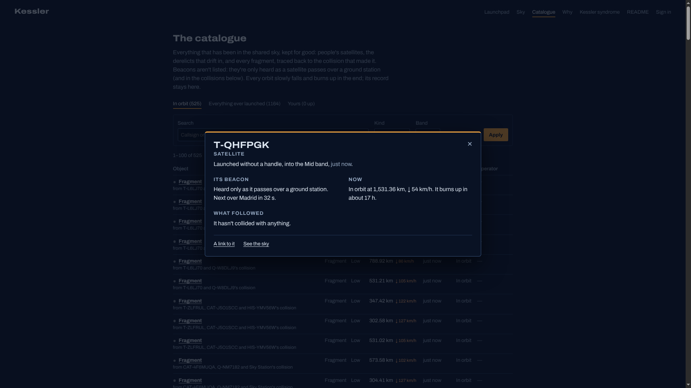

Commit `fe908a4`.

## 2026-10-07 — Review fix 5: the question opt-in, copy that matches, tests that would catch it

Acting on the review's findings 2 and 8, and two of its opinions:

- **Answering the question is opt-in.** "My beacon answers it" (the ADR's
  wording, now the box's too) is no longer ticked for you: a default tick
  tagged lines like "Second launch, mid band." as answers and manufactured
  "both were answering" connections.
- **The day turns at midnight in Canberra** (standard time, so 1 am in
  summer), not at 10 or 11 in the morning there.
- **Copy that the code contradicted**, fixed: the Why page no longer says
  bringing yours down is "taking your words back" (the record keeps them),
  says "nobody moderates (beyond a small filter on words)", says several
  overhead take turns, says your own listening never counts towards yours
  (not "nobody can raise their own"), and mentions derelicts' echoes; its
  "what it's about" is a little shorter. A live beacon's history says "not
  heard yet" until it has been, then "it's read out each time it's on air
  over a ground station" (it said "heard only…", beside a line anyone could
  already read). The catalogue no longer says beacons are only heard at the
  stations: what's been heard is beside the sky. ADRs 0015 and 0018 (still
  proposed) and `PLAN.md` say what the code now does.
- **Tests that would have passed with things broken**: the stream's
  per-viewer filter moved into `src/lib/stream.ts` and is tested (a heard
  event says `mine` to its owner and not to others, with no owner or
  operator); words through a cascade replay (the cascade test now has
  twelve people's satellites among the forty derelicts, and the stopped
  and running servers' fragments carry the same words; before, the crowd
  was all derelicts, so silent); the hello's `heardBy` can't be null; the
  operator test's check for leaked owners matches keys, not a fragment
  that happens to say "owner" (it failed on a dirty database); the
  400-orbit stations test gets 20 s, as the cascade test did, since it
  passed 5 s under a loaded suite.

`pnpm check` green twice in a row on a fresh database (284 tests). Commit `262e2b4`.

## 2026-10-07 — Second adversarial review

A fresh Sonnet reviewer, without the drafting context, re-attacked the
round at `49914ee`: curl and node scripts against the running build and
throwaway databases, Chromium at 1920, 1440, 1366, 1280, 1024 and 900 px
wide and an iPhone, and the code. All 284 tests green. Its verdicts on the
first review's findings: the copy, the feed and the airtime rule fixed;
the inflatable "heard by", the hidden-tab pause, ask 6 and the sky's card
only partly.

Must-fix:

1. **A made-up cookie still counts.** Six streams carrying a random UUID
   as their person cookie, with no page ever loaded, made a new satellite
   "Heard by 6 people". The rule only refused a cookie minted for the
   stream itself. And the 200-listener cap took the first 200 to
   subscribe, so 200 scripted streams opened early would crowd out every
   real listener.
2. **Late arrivals are never credited.** Only the people listening at a
   pass's first second on air got it; someone who opened the sky 2 s into
   a turn heard the whole rest of it and wasn't counted (unless the room
   was otherwise empty). The busy room is the case that matters.
3. **A 140-character line is clipped in the stations panel** at 1024 to
   1366 px wide: three lines aren't enough in a 335 to 368 px column. The
   log's "a 140-character line fits the column" was wrong; it fits from
   about 1440 px and on phones.
4. **A tab opened in the background never pauses**: only a change of
   visibility was handled, so a tab that was never seen counts forever. A
   reconnect pending when it paused could reopen the stream, and a paused
   tab still said "Just you, listening".
5. **The derelicts already up have no echoes.** Only new ones get one, and
   the live ones last up to three days, so a visit soon after deploying
   meets silent derelicts, which is most collisions.
6. **The encounter notice faded after 12 s** on a desktop, taken for a
   launch notice.

Should-fix: on the sky between about 900 and 1500 px the card covers the
globe; switching cards kept the old one's scroll (the wrong element was
reset); the announcement of how many are listening never went out while
people kept arriving or leaving (each change restarted its wait); "since
you last looked" counted rows of being heard, not people; closing a card
opened at an object's address kept that object's title, missed an address
without its trailing slash, and kept `?object=` in the catalogue's;
stale lines in ADRs 0016 and 0017 and a test comment; the ear sampled
twice a second; the sky's feed test checks nothing on a fresh database;
a derelict's card says "it went up before anything here had gone" for
every derelict without an echo, and a satellite's "hasn't passed over a
station while anyone was listening" is the old rule. Opinions: the
question's day would be better from the time zone (it says 1 am in
summer); the beacons column lost its `aside` landmark; looking back ten
minutes after a stall blocked the event loop for 3.9 s in a crowded
harness.

Checked and fine: focus after a manoeuvre from a card, the opt-in box,
an empty launch no longer asks you to sign up, the sky's card non-modal
and switchable, no overflow on a phone, one cookie set at an object's
address, the same-pass rule against a brute-force oracle (449 of 453
passes, no extras), and no owner leaking through the stream.

Logged with its fixes: commit `5f14155`.

## 2026-10-07 — Review fix 6: the second review's findings

All six must-fixes, and most of the rest:

- **Only a browser that has loaded something here is listening.** Any
  request but the event stream notes its browser (hashed, as a listener
  is) in a new `visitors` table (migration `0009_visitors`); a stream
  counts only if its cookie is there. Kept rather than held in memory, so
  the tabs that reconnect after a deploy still count. This replaces the
  "cookie made for this request" rule, and `locals.newPerson` is gone.
  Checked against the running build: six streams with made-up cookies,
  then a seventh, read "listening: 0"; a browser that loaded `/sky/`
  first read 1. A script can still load a page first, like any new
  browser (ADR 0009's cost, said in ADR 0016).
- **The cap is drawn at random**, so 200 streams opened first can't crowd
  out the people who came after.
- **Someone who starts listening mid-pass is credited.** Each pass is kept
  with who it has credited; every second on air credits whoever is newly
  listening (the transmission row is written once, its count updated),
  and everyone is told the new count, which updates the card where it is
  (an older pass's recount changes the counts, not the "last heard").
- **The ear looks once per tick** (it sampled twice, as the interval
  drifts past a second) **and two minutes back at most**, not ten, after
  a stall (ten held the event loop for 3.9 s in the reviewer's crowded
  harness). The heard tests that span a lap listen a minute at a time.
- **The announcement of how many are listening** is a trailing throttle:
  a change starts the wait and later changes don't restart it.
- **"Since you last looked"** counts people, each once (`countDistinct`),
  and says "3 people heard yours", not "3 more people".
- **Derelicts already up get echoes** at the server's first settle, once,
  before anything moves (so a replay after a stop still breaks the same
  words). A derelict's card no longer says "it went up before anything
  had gone" of every echo-less one, nor "long gone" of a satellite
  brought down a minute ago.
- **The encounter notice** has its own id, stays until its × is clicked,
  and sits over the bottom left of the scene, clear of the view buttons
  (the first try, at the top, covered them at 1280 px wide) and of a
  collision's card. On a phone, making the notice hold its close button
  (`position: relative`) let its desktop `left: 50%` push it off screen
  and widen the page to 569 px; caught on the iPhone check and fixed.
- **A 140-character line takes four lines** in the stations below
  1440 px wide, as on a phone (measured at 1280x720: scrollHeight 76,
  clientHeight 76; it was 76 against 57).
- **On the sky between 832 and 1440 px the card covers the beacons
  column**, not the globe.
- **A tab opened hidden pauses** after a minute like one hidden later; a
  reconnect pending at the pause no longer reopens the stream; a paused
  tab says "Not listening while hidden".
- **Closing a card** opened at `/object/12`, `/object/12/` or the
  catalogue's `?object=12` leaves the catalogue at its own address
  (keeping `show=mine`) with its own title, and focus on its heading.
  Switching cards starts the new one at its top (the dialog scrolls, not
  its body).
- **The question's day** follows Canberra's clock (`Intl`, Sydney's zone),
  summer time included, so it turns at midnight there all year; the
  tests check a summer and a winter midnight.
- The beacons column is an `aside` again; "Not heard yet" says "on air";
  ADRs 0016 and 0017 (proposed) say what the code now does (the feed
  updates cards in place, derelicts carry echoes, the listening rules,
  nothing pruned yet).

Not done: the sky's feed test still checks only the empty state on a
fresh database (a pass over HTTP is minutes away; the cards' content is
covered by the server tests); `transmissions`, `listens` and `visitors`
aren't pruned; the listener hash stays unkeyed (said in ADR 0016).

Tests first where they could be: late listeners, the random cap, made-up
cookies and remembering visitors after a restart, the announcement under
churn (these four failed against the old code), news counting people,
the echo backfill, and the summer midnight. `pnpm check` green (289
tests, 0 errors, 0 warnings); `pnpm check:evidence` green. Checked in
Chromium at 1280x720 (four-line beacon, the card over the column, the
notice clear of the buttons), 1920x1080, 1366x768 (switching cards) and
an iPhone 14 (390 wide, no overflow, the notice dismissed).

Commit `5f14155`.

## 2026-10-08 — A code review of PR 7, its fixes, and an adversarial review of those

A `/code-review` of PR 7 (high effort) reported ten findings. Fixed, test
first where there was a contract to test:

- **The wreck lost words in a nearly full sky.** Shards were cut for every
  fragment `fragmentsOf` made, then the fragments were cut to `LIVE_CAP`,
  so the words dealt to the dropped ones went with them (at the cap, all of
  them). Now the shards are cut for the fragments there's room for. New
  test, with `LIVE_CAP=2`: every word of both still survives.
- **A failed write left `listen()` thinking a pass was logged.** The
  in-memory pass (and who it had credited) was set before the transaction;
  if it threw, the rest of the pass updated transmission row 0 (nothing)
  while still inserting `listens`, so "heard by" could be above zero with
  no passes. Now a failed write puts the passes back as they were (newest
  first), so the pass starts again at the next look. Tested with a trigger
  that aborts the insert.
- **"One of yours met something" came back on every visit** after it was
  dismissed, since only Yours moved the seen cookie. Dismissing now sets
  `kessler_met` to the encounter's time, and the sky tells only encounters
  after the later of that and the last look at Yours (`newsFrom`, new
  `spec/seen.test.ts`).
- **Every request without a cookie wrote a `visitors` row, for good**
  (crawlers, link previews). A cookie the server hasn't kept is now held in
  memory (ten minutes, at most 10,000) and written down when it comes back:
  its page's stream, or any other request.
- **One person was two listeners** once they signed in (`p:<hash>`, then
  `o:<id>`). `link()` (claim and sign-in) now moves the cookie's `listens`
  rows to the operator. `listenerKey` moved to `src/lib/listener.ts`, so
  `operators.ts` can use it without an import cycle.
- Efficiency: `encountersOf` takes `since` and `limit` in SQL. Yours reads
  its encounters once (`newsSince` takes the list). The sky asks for one
  encounter, not every story. `/object/<id>/` checks existence with
  `objectById` instead of a second `historyOf`. `heardTotals` runs only in
  Yours.
- The beacon counter counts as the textarea's `maxlength` does (UTF-16
  units), so it never says there's room the field won't give.
- One finding was half wrong: `heardBy(id)` in `heard.ts` isn't dead (the
  spec uses it), but its comment claimed it counted passes. The comment is
  fixed.

Then a fresh Sonnet reviewer attacked the fixes. It judged 1, 3, 5–9
complete, and 2, 4 and 10 partial:

- **Rollback order**: two passes started for one key in one look would
  restore the wrong one. Fixed by rolling back newest first.
- **A second device signing in** carried over what it had heard of the
  operator's own satellites, as the owner hearing their own. `link()` now
  drops those rows (new test).
- **A tab still open from before signing in** kept crediting the old cookie
  key. Signing in now maps that key to the operator in memory
  (`listener.ts`), for crediting and for the listening count (the sign-in
  test now listens through such a tab).
- **A made-up cookie, new each time**, was still written down, since it
  was well formed. Now any cookie the server hasn't kept needs a second
  sighting, so the "minted" flag is gone and the middleware is simpler.

Left as said in ADR 0016 (updated, still proposed): a restart within ten
minutes of someone's first page forgets them until they load something
else. Signing out makes someone new, as it does for launching. A
dismissal is per browser. No HTTP test drives the met notice, since an
encounter can't be staged over HTTP. Re-review not run: the revision was
four targeted fixes, each with its own test.

`pnpm check` green (297 tests, 0 errors, 0 warnings) against a fresh
build on a scratch database; `pnpm check:evidence` green. Commit `bef0696`.

## 2026-10-08 — Advay's look at the running app: a lost link, cramped selects, a redundant box

Advay reviewed PR 7 in the browser and raised four things.

- **"What's Kessler syndrome?" was hard to see** under the new "What this
  is, and why" button. It was plain dim text over the launchpad's warm
  afterglow. It's now a small dark chip with an amber edge: still quieter
  than the button above it, but it reads.
- **The catalogue's Kind and Band selects had their chevrons against the
  right edge** (the browser's own, with only the text's 0.5 rem of
  padding). They now draw their own chevron, in `--ink-dim`, 0.7 rem in,
  with 2 rem of padding for it.
- **"Only yours" was redundant** now that Yours is a view of its own (ADR
  0015), and it showed in every view but Yours. The box is gone, and so
  is `mine` from the catalogue query. An old `?mine=1` link opens Yours.
  The spec test now checks Yours, the old link, and that no view has the
  box (it failed first on the old link).
- **Is the Why page redundant?** Asked, not changed: see below.

`pnpm check` green (297 tests, 0 errors, 0 warnings) against a fresh
build; the launchpad and catalogue checked at 1920x1080 with
`agent-browser`. Commit `a3a6af2`.

## 2026-10-08 — The Kessler syndrome page keeps to the physics; Why keeps the argument

Advay's question above: is the Why page redundant? Not with the README,
which tells the project to the marker; Why is for people in the app.
The overlap was between `/why/` and `/kessler/`, which both argued the
commons (Hardin, Ostrom) and both said how the app maps onto it. Advay
picked trimming Kessler over merging the two:

- **Kessler** keeps the cascade, the real cases and the regulation facts
  (the FCC's five-year rule), plus its real-orbit-to-this-sky table, now
  without the rows and clauses that re-explained being heard and static.
  It names Hardin once, drops Ostrom, and hands "what it's for" to Why.
- **Why** keeps the purpose, the commons argument and its own
  sky-to-attention mapping, and now lists the three sources it argues
  from (Hardin, Kessler and Cour-Palais, Ostrom).

New spec test: Kessler links to Why and doesn't argue Ostrom or explain
being heard again, and Why cites its three sources. It failed first.

Checking the pages in Chrome (1920x1080, iPhone 14; no horizontal
overflow) turned up an older bug. Astro drops the space where a line of
text breaks before or after a tag, so the Kessler page's sources read
"Science162" and "belt.Journal", and the table said "every3 minutes" (the
last introduced by this trim). They now have explicit spaces, with a
regression test on both pages' sources and figures (it failed on the old
build).

`pnpm check` green (300 tests, 0 errors, 0 warnings) against a fresh
build. Commit `a3a6af2`.

## 2026-10-08 — The sky's boxes fold

Advay found the sky crowded: the Sky now panel over the scene, and
Beacons and Heard down the right. Each now folds to its heading row (so
"Live" and "Just you, listening" stay in view) with a chevron button at
the end of the row: down while open, right once folded. Folding Beacons
gives Heard the column, and folding Sky now clears the scene.

- `src/scripts/collapsible.ts` wires any `[data-collapsible]` box: the
  button (`aria-expanded`, `aria-controls` its body, named by the box's
  heading) shows or hides the body, and the state is kept per browser in
  `localStorage`, read and written inside try/catch, so a browser that
  keeps nothing just starts open.
- Without JavaScript the boxes are served open and the buttons hidden,
  so nothing is ever out of reach.

Tests first: `spec/collapsible.test.ts` (JSDOM: starts open, folds and
unfolds one box alone, remembered, works with storage that throws) and a
spec test that the sky serves its three boxes open with hidden buttons
whose bodies are inside the box and exclude the heading. Both failed
first. `pnpm check` green (305 tests, 0 errors, 0 warnings) against a
fresh build. Checked in Chrome at 1920x1080 (all three folded, still
folded after a reload) and on an iPhone 14 (390 wide, no overflow).
